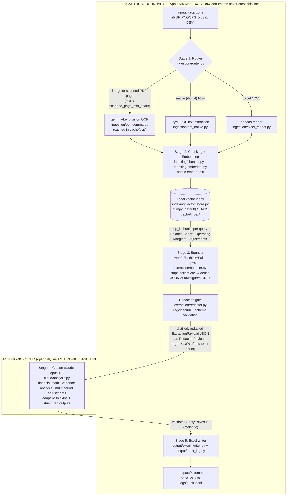

# PLAN.md — Hybrid Local + Cloud Automated Financial Data Pipeline

**Target platform:** Apple M5 Mac (16GB RAM), macOS, Python 3.11+
**Local inference:** Ollama @ `http://localhost:11434` — `gemma4:e4b` (vision/OCR), `qwen3:8b` (extraction "Bouncer"), `nomic-embed-text` (embeddings)
**Cloud reasoning:** Anthropic Claude (`claude-opus-4-8`, configurable; gateway routing supported via `ANTHROPIC_BASE_URL`)
**Output:** formatted `.xlsx` via pandas + openpyxl, with a full local audit trail

---

## How to use this document

This is a **build blueprint for a code-generation agent**. It is written so the system can be built without guessing:

- **Section 2 is the naming authority.** Every path, module, config key, and `Settings` field defined there is canonical; later sections reference them verbatim. Do not rename anything.
- **Code blueprints are contract-final.** All signatures, dataclass/pydantic fields, constants, and exception types are final; only bodies marked `TODO(codegen)` are to be filled in.
- **Build in phase order (Section 11).** Each phase lists exact deliverable files and runnable acceptance criteria. Every phase must leave `pipeline doctor` exiting 0 and the unit suite green.
- **Prompts are load-bearing.** OCR, Bouncer, and cloud system prompts are specified verbatim (or with explicit acceptance criteria where delegated). Version constants (`OCR_PROMPT_VERSION`, `BOUNCER_PROMPT_VERSION`, `CLOUD_PROMPT_VERSION`) key the cache layers — bump them when editing prompt text.

### Non-negotiable invariants

1. **$0.00 pre-processing** — Stages 1–3 (ingestion, OCR, indexing, extraction) run exclusively on local Ollama.
2. **Privacy boundary** — raw documents and OCR text never leave the machine. The only outbound bytes are the redacted `ExtractionPayload` JSON plus a static system prompt. Enforced structurally (import graph), at the type level (`RedactedPayload`), and by test (`tests/test_privacy_boundary.py`).
3. **16GB RAM discipline** — `gemma4:e4b` and `qwen3:8b` are never resident simultaneously; the orchestrator runs stage-major with `ModelManager.swap_to()` at stage boundaries.
4. **≥90% cloud-token reduction** — retrieval + Bouncer distillation shrink a 40–80K-token raw document to a 1–3K-token payload; measured per run and recorded in the audit log.
5. **Idempotent re-runs** — every stage is content-hash cached; re-running an unchanged file makes zero Ollama calls and zero cloud calls.

### Document map

| Section | Contents |
|---|---|
| 1 | Executive overview, design goals, architecture diagram, stage→module map |
| 2 | Directory tree, `settings.yaml`, `.env.example`, `pyproject.toml`, `config.py` (naming authority) |
| 3 | Ollama client wrapper + 16GB model-residency manager |
| 4 | Stage 1 — file router, native-PDF extraction, gemma OCR (+cache), Excel/CSV reader |
| 5 | Stage 2 — chunking, embeddings, numpy/FAISS vector store |
| 6 | Stage 3 — Bouncer extraction schemas, prompts, redaction gate |
| 7 | Stage 4 — Claude client, structured outputs, prompt caching, budget ledger, batch mode |
| 8 | Stage 5 — Excel workbook writer + audit log |
| 9 | Orchestrator & CLI (`run` / `doctor` / `index` / `batch-poll`) |
| 10 | Failure-mode table, privacy guarantees, idempotency/caching layers |
| 11 | Implementation phases P0–P7 with acceptance criteria and test strategy |
| 12 | **Architecture Amendments v1.1 (BINDING)** — resolutions of the 15 pre-implementation review decisions; overrides any conflicting text in Sections 1–11 |

---
## 1. Executive Overview & Architecture

This system is a **hybrid local+cloud financial data pipeline** running on a 16GB Apple M5 Mac. All document ingestion, OCR, embedding, retrieval, and extraction happen locally at $0.00 via Ollama; only a tiny, redacted, schema-validated JSON payload of raw financial figures ever crosses the network to Claude (`claude-opus-4-8`) for financial reasoning. The result comes back as a formatted `.xlsx` plus a full audit trail.

### 1.1 Design Goals

| # | Goal | Target | Mechanism | Enforced by |
|---|------|--------|-----------|-------------|
| G1 | Zero-cost pre-processing | $0.00 for Stages 1–3 | All OCR (`gemma4:e4b`), extraction (`qwen3:8b`), and embeddings (`nomic-embed-text`) run on local Ollama | `src/pipeline/local_llm/ollama_client.py` is the only inference path before Stage 4 |
| G2 | Data privacy | Raw documents NEVER leave the machine | Only the Bouncer's distilled JSON — after regex redaction and schema validation — is sent to the cloud, as an `ExtractionPayload` wrapped in the frozen `RedactedPayload` produced solely by `Redactor.redact_payload()`, serialized WITHOUT `verbatim_context` — no free-form source snippet ever egresses (§12-A1) | `extraction/redactor.py` gate + `cloud/claude_client.py` — `ClaudeClient.analyze()` accepts only `RedactedPayload` instances, never file paths or raw text (`tests/test_privacy_boundary.py` import-graph assertion) |
| G3 | 16GB RAM discipline | Never two large models resident simultaneously | `ModelManager.swap_to()` at stage boundaries: `keep_alive="0s"` eviction of the outgoing model + `client.ps()` residency check before loading the next model with `settings.ollama.keep_alive` | `local_llm/model_manager.py` (`swap_to()` / `release_all()`) |
| G4 | Cloud token reduction | ≥90% fewer input tokens vs. sending raw text | Embedding retrieval (top-k chunks only) → qwen3 distillation to dense JSON; raw-document token counts are estimated LOCALLY via the `len(text)//4` heuristic (same heuristic as the chunker — raw text is never sent to any tokenizer API); `client.messages.count_tokens()` is called ONLY on the final outbound request and includes `system=<the system blocks>` so the measurement is complete | `output/audit_log.py` records `raw_tokens_est` (local estimate), `payload_tokens` (`count_tokens`), `reduction_pct` per file |
| G5 | Cost governance | Hard monthly budget | Pre-flight cost estimate + month-to-date spend (`BudgetLedger` over `logs/spend.jsonl`) checked against `cloud.monthly_budget_usd`; `BudgetExceededError` is raised BEFORE the API call | `cloud/claude_client.py` budget guard |
| G6 | Determinism & auditability | Reproducible extraction, traceable figures | `temperature=0`, `think=False`, JSON-schema-constrained decoding locally; structured outputs (`messages.parse`) in cloud; every figure carries source page/chunk provenance | `extraction/schemas.py` + `logs/audit.jsonl` (`AuditLog`) |

### 1.2 Five-Stage Pipeline & Trust Boundary



Exactly **one payload-bearing arrow crosses the boundary outbound** (the live path additionally sends the same outbound bytes to `messages.count_tokens` for the pre-flight — §12-A14/F57; `--dry-run` estimates locally and egresses nothing), and it carries only the redacted `ExtractionPayload` — serialized **without** `verbatim_context` (§12-A1) — delivered as the frozen `RedactedPayload` wrapper that `Redactor.redact_payload()` alone can produce. This is a structural invariant: `cloud/claude_client.py` has no imports from `ingestion/` or `indexing/` and its public functions accept only `RedactedPayload` (a test in `tests/test_privacy_boundary.py` asserts this import graph).

### 1.3 Stage → Module Mapping

| Stage | Responsibility | Modules (canonical paths) | Model / library | Cost |
|-------|----------------|---------------------------|-----------------|------|
| 1. Ingestion & Router | Detect file type; per-page scanned-vs-native PDF triage; dispatch | `src/pipeline/ingestion/router.py`, `ingestion/pdf_native.py`, `ingestion/ocr_gemma.py`, `ingestion/excel_reader.py` | `gemma4:e4b` (vision), PyMuPDF (`fitz`), pandas | $0 |
| 2. Chunking & Embedding | Token-budgeted chunking with overlap; embeddings (batched inside `OllamaClient.embed`); persisted local index | `src/pipeline/indexing/chunker.py`, `indexing/embedder.py`, `indexing/vector_store.py` | `nomic-embed-text`; numpy (default) or faiss-cpu | $0 |
| 3. Bouncer | Retrieve financially relevant chunks; strip boilerplate; emit schema-constrained JSON of raw figures (`ExtractionPayload`); redact | `src/pipeline/extraction/bouncer.py`, `extraction/schemas.py`, `extraction/redactor.py` | `qwen3:8b` with `format=bouncer_schema()`, `think=False` | $0 |
| 4. Cloud Reasoning | Financial math, variance analysis, multi-period adjustments on distilled JSON; prompt caching; budget guard; optional Batch API bulk mode | `src/pipeline/cloud/claude_client.py`, `cloud/analysis.py` | `anthropic` SDK, `claude-opus-4-8`, `messages.parse` | metered |
| 5. Output | Formatted multi-sheet workbook (`outputs/<stem>.<sha12>.xlsx`, deterministic) + one machine-readable audit line per file in `logs/audit.jsonl` (token counts, cost, provenance) | `src/pipeline/output/excel_writer.py`, `output/audit_log.py` | pandas + openpyxl | $0 |
| Cross-cutting | Config contract, CLI, orchestration, model residency | `src/pipeline/config.py`, `cli.py`, `orchestrator.py`, `local_llm/ollama_client.py`, `local_llm/model_manager.py` | typer, rich, pydantic | $0 |

**RAM choreography (G3):** `gemma4:e4b` (~4–6GB resident) and `qwen3:8b` (~5–7GB resident) must never be loaded together. `model_manager.py` exposes `ModelManager.swap_to(model)` — called by the orchestrator at stage boundaries — which issues a zero-token `client.chat(model=<other>, keep_alive="0s")` eviction for any other large model reported by `client.ps()`, then loads the requested model with `settings.ollama.keep_alive` (no hardcoded keep-alive constant), polling `ps()` until the swap completes (typical swap: 5–20s; `SWAP_TIMEOUT_S = 120.0`). `release_all()` evicts every resident model at pipeline shutdown. `nomic-embed-text` (~280MB) is small enough to co-reside with either.

## 2. Project Skeleton & Configuration

This section is the **single source of truth for paths, config keys, and the `Settings` object**. Every other section references these names verbatim; the code-gen agent must not rename anything here.

### 2.1 Canonical Directory Tree

```
.                                        # repo root
├── PLAN.md                              # this blueprint
├── pyproject.toml                       # package metadata + pinned dependencies (§2.4)
├── .env.example                         # template for secrets; copied to .env (never committed)
├── .gitignore                           # entries in §2.6
├── README.md                            # quickstart: ollama pull commands, cp .env.example .env, uv/pip install, CLI usage
├── config/
│   ├── settings.yaml                    # all runtime configuration (§2.2) — the ONLY config file; found via --config / $PIPELINE_CONFIG / ./config/settings.yaml
│   └── schemas/
│       └── financial_payload.schema.json  # FULL ExtractionPayload JSON Schema (incl. figure_id) exported from extraction/schemas.py.
│                                          # Historical filename — the model is named ExtractionPayload. qwen3's `format=` schema
│                                          # is bouncer_schema() (figure_id removed), NOT this file.
├── inputs/                              # user drop zone for PDFs/images/XLSX/CSV (gitignored, .gitkeep committed)
├── outputs/                             # generated <stem>.<sha12>.xlsx — deterministic name, overwritten on re-run (gitignored, .gitkeep committed)
│   ├── quarantine/                      # <stem>.<sha12>.json quarantine records — written ONLY by orchestrator._quarantine()
│   └── batches/                         # <batch_id>.manifest.json — Batch API manifests (custom_id → file mapping)
├── cache/
│   ├── ocr/                             # <file_sha>/page_<n>.json — {"text","dpi","model","prompt_version"} per OCR'd page (gitignored)
│   ├── index/                           # <index_key>.npz + <index_key>.chunks.json — composite §12-A7 key (per document)
│   ├── bouncer/                         # <file_sha>.payload.json — validated ExtractionPayload cache (read/write inside Bouncer.extract)
│   └── cloud/                           # <payload_sha>.json — validated AnalysisResult cache (read/write owned by the orchestrator)
├── logs/                                # rotating pipeline logs, one file per run (gitignored)
│   ├── audit.jsonl                      # the ONLY audit artifact: one AuditRecord line per file, appended by AuditLog
│   └── spend.jsonl                      # append-only per-call cloud spend ledger (BudgetLedger)
├── src/
│   └── pipeline/
│       ├── __init__.py                  # package marker; exposes __version__
│       ├── cli.py                       # typer app: `pipeline run` (--batch, --tasks), `pipeline index`, `pipeline doctor`,
│       │                                #   `pipeline batch-poll <batch_id>`; global --config PATH option; imports SUPPORTED_EXTS from router
│       ├── config.py                    # pydantic Settings contract + load_settings() (§2.5)
│       ├── orchestrator.py              # drives Stages 1→5; owns run_id, error policy, _quarantine() (sole quarantine writer),
│       │                                #   cloud result cache (cache/cloud/), stage timing, exit codes
│       ├── ingestion/
│       │   ├── __init__.py
│       │   ├── router.py                # detect_kind (never raises), extension frozensets + SUPPORTED_EXTS export, max_file_mb guard,
│       │   │                            #   per-page scanned/native triage, ingest() entry point; defines Document & IngestedFile
│       │   ├── pdf_native.py            # PyMuPDF text extraction for digital PDFs; internal PageText (1-based page_number) → router Documents
│       │   ├── ocr_gemma.py             # renders scanned pages to PNG (dpi=200; one dpi=300 retry on degraded pages) → gemma4:e4b vision OCR;
│       │   │                            #   cache per cache/ocr/<file_sha>/page_<n>.json; OCR_PROMPT_VERSION constant
│       │   └── excel_reader.py          # pandas read of xlsx/xlsm (+ pd.read_csv branch) → one Document per sheet;
│       │                                #   CSV yields a single Document (page_number=1, origin="excel")
│       ├── local_llm/
│       │   ├── __init__.py
│       │   ├── ollama_client.py         # thin typed wrapper over `ollama.Client`: chat_json(messages list), ocr_image,
│       │   │                            #   embed (internal batch_size=64), health_check()
│       │   └── model_manager.py         # ModelManager: swap_to(model) / release_all() enforcing single-large-model residency
│       │                                #   via keep_alive="0s" eviction + ps(); SWAP_TIMEOUT_S = 120.0
│       ├── indexing/
│       │   ├── __init__.py
│       │   ├── chunker.py               # chunk_documents(IngestedFile) → list[Chunk] — defines Chunk; token-approximate chunking
│       │   │                            #   (chunk_tokens/chunk_overlap), 1-based page/sheet provenance preserved
│       │   ├── embedder.py              # Embedder: embed_chunks/embed_query — nomic "search_document: "/"search_query: " prefixes,
│       │   │                            #   L2 normalization; NO batching here (batching lives in OllamaClient.embed)
│       │   └── vector_store.py          # NumpyVectorStore (default) + FaissVectorStore behind a common protocol; persist/load cache/index/
│       ├── extraction/
│       │   ├── __init__.py
│       │   ├── bouncer.py               # Bouncer.extract(IngestedFile) — retrieval queries + qwen3:8b schema-constrained distillation
│       │   │                            #   → ExtractionPayload; payload cache in cache/bouncer/; raises BouncerQuarantineError
│       │   ├── schemas.py               # pydantic models: StatementType, FinancialFigure, ExtractionPayload, RedactionEvent;
│       │   │                            #   bouncer_schema() + full JSON-schema export.
│       │   │                            #   (Chunk lives in indexing/chunker.py; AnalysisResult in cloud/claude_client.py)
│       │   └── redactor.py              # Redactor.redact_payload(payload) → RedactedPayload (frozen: payload + events);
│       │                                #   BUILTIN_PATTERNS overlaid with settings; "[REDACTED:{name}]" replacement
│       ├── cloud/
│       │   ├── __init__.py
│       │   ├── claude_client.py         # anthropic.Anthropic built from settings.cloud (§2.5 contract): budget guard, outbound
│       │   │                            #   count_tokens pre-flight, prompt caching, typed errors, batch submit; defines AnalysisResult
│       │   └── analysis.py              # system/user prompts: CLOUD_PROMPT_VERSION, DEFAULT_TASKS, TASK_DESCRIPTIONS,
│       │                                #   build_user_message(redacted, tasks); messages.parse(output_format=AnalysisResult) orchestration
│       └── output/
│           ├── __init__.py
│           ├── excel_writer.py          # write_workbook → outputs/<stem>.<sha12>.xlsx via output_filename(stem, sha12);
│           │                            #   pandas+openpyxl multi-sheet workbook with number formats, headers, provenance sheet
│           └── audit_log.py             # AuditLog.append(AuditRecord) → logs/audit.jsonl (one line per file);
│                                        #   shared status enum; TokenUsage incl. cache_creation_input_tokens
└── tests/
    ├── conftest.py                      # fixtures: tmp Settings, fake ollama/anthropic clients, sample documents
    ├── test_config.py
    ├── test_ingestion_router.py
    ├── test_pdf_native.py
    ├── test_ocr_cache.py
    ├── test_excel_reader.py
    ├── test_chunker.py
    ├── test_vector_store.py
    ├── test_schemas.py
    ├── test_bouncer.py
    ├── test_redactor.py
    ├── test_claude_client.py
    ├── test_analysis.py
    ├── test_excel_writer.py
    ├── test_audit_log.py
    ├── test_model_manager.py
    ├── test_orchestrator.py
    ├── test_privacy_boundary.py         # asserts cloud/ imports nothing from ingestion//indexing/ and analyze() accepts RedactedPayload only
    ├── test_integration_local.py        # end-to-end against a real local Ollama; gated by OLLAMA_ITESTS=1
    ├── fixtures/                        # canned ollama/anthropic JSON responses
    └── data/                            # 1 native PDF, 1 scanned PDF, 1 xlsx, 1 csv
```

### 2.2 `config/settings.yaml` (complete, final)

```yaml
# Financial Data Pipeline — runtime configuration.
# Secrets NEVER live here; they come from .env / environment (§2.3).
# Every key below is bound 1:1 to a pydantic field in src/pipeline/config.py.

ollama:
  host: "http://localhost:11434"     # Ollama server; overridable via OLLAMA_HOST env var
  ocr_model: "gemma4:e4b"            # 4.5B multimodal vision — OCR of screenshots & scanned PDF pages
  extract_model: "qwen3:8b"          # dense text — the "Bouncer" (JSON distillation), run with think=False
  embed_model: "nomic-embed-text"    # ~280MB embedder; may co-reside with either large model
  keep_alive: "5m"                   # residency of the ACTIVE model; ModelManager.swap_to() forces "0s" on the outgoing model
  num_ctx: 8192                      # context window for chat calls (options={"num_ctx": ...})

cloud:
  model: "claude-opus-4-8"           # default cloud model; $5/$25 per MTok
  max_tokens: 8000                   # per-call output ceiling; on stop_reason=="max_tokens" retry exactly once at min(max_tokens*2, 16000)
  enable_prompt_caching: true        # cache_control on system prompt; only effective if prefix ≥ 4096 tokens
  monthly_budget_usd: 25.0           # hard gate: pre-flight estimate + month-to-date (logs/spend.jsonl) must stay under this

index:
  backend: "numpy"                   # "numpy" (default, zero extra deps) | "faiss" (requires faiss-cpu extra)
  chunk_tokens: 512                  # approx tokens per chunk (chars/4 heuristic — no tokenizer dependency)
  chunk_overlap: 64                  # approx tokens of overlap between consecutive chunks
  top_k: 8                           # chunks retrieved per Bouncer query

pipeline:
  scanned_page_min_chars: 32         # len(page.get_text("text").strip()) < this ⇒ page is scanned ⇒ route to gemma OCR
  max_file_mb: 50                    # reject larger input files with a clear CLI error

paths:                               # relative paths resolve against the repo root (parent of config/)
  inputs: "inputs"
  outputs: "outputs"
  cache: "cache"                     # subdirs cache/{ocr,index,bouncer,cloud} and outputs/{quarantine,batches} are derived, not configured
  logs: "logs"

redaction:
  enabled: true                      # if false, orchestrator emits a loud warning banner (a RedactedPayload is still produced, with zero events)
  patterns:                          # dict[str, str]: name -> regex, OVERLAID onto BUILTIN_PATTERNS in extraction/redactor.py.
                                     # Builtin names (canonical set): account_number, ssn, ein, iban, card_number, email.
                                     # On a name collision the config value wins; map a builtin name to "" to disable it.
                                     # Matches in ALL payload string fields are replaced with "[REDACTED:{name}]".
    us_phone: '\b(?:\+?1[ .-]?)?\(?\d{3}\)?[ .-]?\d{3}[ .-]?\d{4}\b'   # example extra pattern (US phone numbers)
    # ssn: ""                        # example: disable the ssn builtin by mapping its name to the empty string
```

Notes for codegen: `redaction.patterns` targets identifiers, not financial figures. The effective pattern set is `BUILTIN_PATTERNS` (defined in `extraction/redactor.py`: account_number, ssn, ein, iban, card_number, email) overlaid with this dict — config wins on name collision, and an empty-string value disables the builtin of that name. `redactor.py` replaces matches with `[REDACTED:{name}]` and records a `RedactionEvent` per hit (hit counts land in the audit record); it must never touch `FinancialFigure.value` (a number, immune to string regexes by construction).

### 2.3 `.env.example`

```bash
# Copy to .env (gitignored). load_settings() reads this via python-dotenv.
# REQUIRED for Stage 4 (cloud). Stages 1-3 and `pipeline index` run without it.
ANTHROPIC_API_KEY=sk-ant-...

# OPTIONAL: route cloud calls through a gateway/proxy. Leave unset for api.anthropic.com.
# ANTHROPIC_BASE_URL=https://your-gateway.example.com

# OPTIONAL: override ollama.host from settings.yaml (e.g., remote Ollama box).
# OLLAMA_HOST=http://localhost:11434

# OPTIONAL: absolute path to settings.yaml; checked before ./config/settings.yaml (see §2.5).
# PIPELINE_CONFIG=/path/to/settings.yaml

# RECOMMENDED (server-side setting — NOT read from this .env): cap the Ollama server to
# one resident model as belt-and-suspenders alongside ModelManager.swap_to().
# The Ollama server must see this in ITS environment; on macOS set it via:
#   launchctl setenv OLLAMA_MAX_LOADED_MODELS 1
# then restart the Ollama app.
# OLLAMA_MAX_LOADED_MODELS=1
```

### 2.4 `pyproject.toml` dependency block

```toml
[project]
name = "financial-pipeline"
version = "0.1.0"
requires-python = ">=3.11"
dependencies = [
    "ollama",
    "anthropic",
    "pydantic>=2",
    "pandas",
    "openpyxl",
    "pymupdf",
    "numpy",
    "tenacity",
    "typer",
    "rich",
    "python-dotenv",
    "pyyaml",
]

[project.optional-dependencies]
faiss = ["faiss-cpu"]        # only needed when index.backend = "faiss"
dev = ["pytest"]

[project.scripts]
pipeline = "pipeline.cli:app"

[build-system]
requires = ["setuptools>=68"]
build-backend = "setuptools.build_meta"

[tool.setuptools.packages.find]
where = ["src"]
```

### 2.5 `src/pipeline/config.py` (blueprint — fields and signatures final)

```python
"""Configuration contract for the financial pipeline.

Single source of truth: every module receives a `Settings` instance built by
`load_settings()`. No module reads YAML or os.environ directly — env merging
happens here, once. Secrets (API key) are env-only and held as SecretStr so
they never appear in logs, reprs, or audit output.
"""
from __future__ import annotations

import os
from pathlib import Path
from typing import Any, Literal

import yaml
from dotenv import load_dotenv
from pydantic import BaseModel, Field, SecretStr, field_validator


class OllamaConfig(BaseModel):
    """Bound to the `ollama:` block of config/settings.yaml."""
    host: str = "http://localhost:11434"
    ocr_model: str = "gemma4:e4b"
    extract_model: str = "qwen3:8b"
    embed_model: str = "nomic-embed-text"
    keep_alive: str = "5m"          # residency for the active model; ModelManager.swap_to() uses "0s" to evict
    num_ctx: int = Field(default=8192, ge=2048)


class CloudConfig(BaseModel):
    """Bound to the `cloud:` block. `api_key`/`base_url` are env-only (never YAML)."""
    model: str = "claude-opus-4-8"
    max_tokens: int = Field(default=8000, le=16000)  # per-call output ceiling; on stop_reason=="max_tokens"
                                                     # ClaudeClient retries exactly once at min(max_tokens*2, 16000)
    enable_prompt_caching: bool = True
    monthly_budget_usd: float = Field(default=25.0, gt=0)
    api_key: SecretStr | None = None     # from ANTHROPIC_API_KEY; None => cloud stage unavailable
    base_url: str | None = None          # from ANTHROPIC_BASE_URL; None => SDK default endpoint


class IndexConfig(BaseModel):
    """Bound to the `index:` block."""
    backend: Literal["numpy", "faiss"] = "numpy"
    chunk_tokens: int = Field(default=512, ge=64)
    chunk_overlap: int = Field(default=64, ge=0)
    top_k: int = Field(default=8, ge=1)

    @field_validator("chunk_overlap")
    @classmethod
    def _overlap_lt_chunk(cls, v: int, info: Any) -> int:
        """Reject overlap >= chunk_tokens (would loop forever in chunker)."""
        # TODO(codegen): access info.data["chunk_tokens"]; raise ValueError if v >= it.
        return v


class PipelineConfig(BaseModel):
    """Bound to the `pipeline:` block."""
    scanned_page_min_chars: int = Field(default=32, ge=0)
    max_file_mb: int = Field(default=50, ge=1)


class RedactionConfig(BaseModel):
    """Bound to the `redaction:` block.

    `patterns` maps pattern name -> regex and is OVERLAID onto
    `extraction/redactor.py::BUILTIN_PATTERNS` (account_number, ssn, ein,
    iban, card_number, email): on a name collision the config value wins,
    and mapping a builtin name to "" disables that builtin. Matches are
    replaced with "[REDACTED:{name}]".
    """
    enabled: bool = True
    patterns: dict[str, str] = Field(default_factory=dict)

    @field_validator("patterns")
    @classmethod
    def _compilable(cls, v: dict[str, str]) -> dict[str, str]:
        """Fail fast at load time if any regex value does not compile.

        Empty-string values are allowed (they disable a builtin) and are
        skipped by the compile check.
        """
        # TODO(codegen): re.compile each non-empty value; raise ValueError naming the bad pattern.
        return v


class PathsConfig(BaseModel):
    """Bound to the `paths:` block. Relative paths are resolved against the repo root by load_settings()."""
    inputs: Path = Path("inputs")
    outputs: Path = Path("outputs")
    cache: Path = Path("cache")
    logs: Path = Path("logs")

    @property
    def ocr_cache(self) -> Path:
        return self.cache / "ocr"

    @property
    def index_cache(self) -> Path:
        return self.cache / "index"

    @property
    def bouncer_cache(self) -> Path:
        return self.cache / "bouncer"

    @property
    def cloud_cache(self) -> Path:
        return self.cache / "cloud"

    @property
    def quarantine_dir(self) -> Path:
        return self.outputs / "quarantine"

    @property
    def batches_dir(self) -> Path:
        return self.outputs / "batches"

    def ensure(self) -> None:
        """mkdir -p every directory (inputs, outputs, outputs/quarantine, outputs/batches,
        cache/ocr, cache/index, cache/bouncer, cache/cloud, logs)."""
        # TODO(codegen): create all nine dirs with parents=True, exist_ok=True.
        ...


class Settings(BaseModel):
    """Root settings object passed to every pipeline component."""
    ollama: OllamaConfig = Field(default_factory=OllamaConfig)
    cloud: CloudConfig = Field(default_factory=CloudConfig)
    index: IndexConfig = Field(default_factory=IndexConfig)
    pipeline: PipelineConfig = Field(default_factory=PipelineConfig)
    redaction: RedactionConfig = Field(default_factory=RedactionConfig)
    paths: PathsConfig = Field(default_factory=PathsConfig)


def load_settings(path: str | Path | None = None) -> Settings:
    """Build Settings from YAML merged with environment variables.

    Config-file resolution order (first hit wins):
      1. explicit `path` argument — the CLI's global `--config PATH` option passes it here
      2. $PIPELINE_CONFIG environment variable
      3. ./config/settings.yaml
      4. otherwise raise an ACTIONABLE error naming all three options above

    Merge order (later wins):
      1. pydantic field defaults (above)
      2. the resolved YAML file
      3. Environment / .env:  ANTHROPIC_API_KEY -> cloud.api_key,
                              ANTHROPIC_BASE_URL -> cloud.base_url,
                              OLLAMA_HOST -> ollama.host

    Side effects: calls load_dotenv() (repo-root .env, non-overriding of real env);
    resolves every PathsConfig entry relative to the YAML file's parent's parent
    (the repo root); calls settings.paths.ensure().

    Raises:
        FileNotFoundError: no config file found via the resolution order above —
            the message tells the user to create config/settings.yaml, pass
            --config PATH, or set $PIPELINE_CONFIG.
        pydantic.ValidationError: YAML values violate the field constraints above.
    """
    load_dotenv()
    # TODO(codegen): resolve the config path per the documented order:
    #   path arg if given -> os.environ.get("PIPELINE_CONFIG") -> Path("config/settings.yaml");
    #   if none exists, raise FileNotFoundError with the actionable message above.
    path = Path(path)  # placeholder for the resolved path
    raw: dict[str, Any] = yaml.safe_load(path.read_text(encoding="utf-8")) or {}
    # TODO(codegen): env merge exactly as documented:
    #   raw.setdefault("cloud", {})["api_key"] = os.environ.get("ANTHROPIC_API_KEY") or None
    #   base_url = os.environ.get("ANTHROPIC_BASE_URL");  set raw["cloud"]["base_url"] if truthy
    #   ollama_host = os.environ.get("OLLAMA_HOST");      set raw["ollama"]["host"] if truthy
    # TODO(codegen): settings = Settings.model_validate(raw)
    # TODO(codegen): repo_root = path.resolve().parent.parent; rebase each non-absolute
    #   paths.* field via model_copy(update=...); then settings.paths.ensure()
    # TODO(codegen): return settings
    ...
```

Contract rules for all other sections: components take `settings: Settings` (or a sub-config) in their constructor — never a raw dict; `cloud/claude_client.py` constructs its SDK client exclusively from `settings.cloud` as `anthropic.Anthropic(api_key=cfg.cloud.api_key.get_secret_value() if cfg.cloud.api_key else None, base_url=cfg.cloud.base_url)` (a `None` key falls back to the SDK's env handling), then `.with_options(timeout=..., max_retries=3)`; `pipeline doctor` (CLI) calls `load_settings()` then verifies Ollama reachability via `client.list()` and that all three `ollama.*_model` names are installed.

### 2.6 `.gitignore`

```gitignore
# secrets
.env

# data & artifacts (structure kept via .gitkeep)
inputs/*
!inputs/.gitkeep
outputs/*
!outputs/.gitkeep
cache/
logs/

# python
__pycache__/
*.pyc
.venv/
.pytest_cache/
*.egg-info/
dist/
build/
```
## 3. Local Inference Layer

This layer is the only code that touches the Ollama daemon. Two modules: `src/pipeline/local_llm/ollama_client.py` (typed transport wrapper — every local token generated in this system flows through it) and `src/pipeline/local_llm/model_manager.py` (RAM residency policy). Nothing else in `src/` may `import ollama`. All local calls run at `temperature=0` and are free by construction — this layer must never fall back to cloud.

> **Model availability note:** `gemma4:e4b` stays the configured default OCR model (user spec: it is pre-pulled on the target machine). `health_check()` / `pipeline doctor` verifies its presence via `client.list()`. If the tag is unavailable in the user's registry, the remedy is a **config-only substitution**: set a vision-capable equivalent (e.g. `gemma3:4b`) as `ollama.ocr_model` in `config/settings.yaml` — no code change anywhere in this layer.

### 3.1 `src/pipeline/local_llm/ollama_client.py`

Design contract:

- One `Client` instance per process, constructed from `ollama.host` in `config/settings.yaml`.
- `health_check()` is **`run_pipeline` step 0**: the orchestrator (Section 9) calls `OllamaClient(settings).health_check()` before any input file is opened, and fails fast with copy-pasteable remediation. Failures here are environment failures — the CLI exits with code **2**.
- `chat_json()` takes a **full `messages: list[dict]` conversation** (multi-turn capable) and uses Ollama's constrained decoding (`format=<JSON schema dict>`) so qwen3:8b is grammatically forced toward the schema. JSON is still parsed defensively: the internal retry happens **exactly once and only on `json.JSONDecodeError`** (a corrective turn is appended and the call re-issued). A second parse failure raises `LocalJSONError` — the Bouncer (Section 5) catches it and quarantines the chunk; this module never silently returns partial data. Schema-level repair is deliberately NOT this module's job: on a pydantic `ValidationError` the **Bouncer builds a multi-turn repair conversation** `[system, user, assistant(<bad JSON>), user(REPAIR_PROMPT)]` and calls `chat_json` again.
- `embed()` is the **only embedding batch layer in the system** (`batch_size=64`, internal). The indexing-side `Embedder` (`indexing/embedder.py`) holds no batch constant — it prefixes its texts and passes the entire list here, and must NOT re-batch.
- `think=False` is passed only on text-model calls (qwen3 thinking mode off → deterministic, fast extraction). It is not sent on vision or embed calls.
- Every method logs model, duration, and `eval_count`/`prompt_eval_count` from the response (when present) at DEBUG to `logs/`.
- `httpx` is imported for exception types only — it is a transitive dependency of the `ollama` SDK, not a new pin.

```python
"""Typed wrapper over the official ``ollama`` Python SDK.

The single gateway for all local inference (OCR, extraction, embeddings).
No other module in ``src/pipeline`` may import ``ollama`` directly, except
``model_manager.py`` which consumes this class.
"""
from __future__ import annotations

import json
import logging
from typing import Any

import httpx
from ollama import Client, ResponseError

from pipeline.config import Settings  # Section 2: pydantic model of config/settings.yaml

logger = logging.getLogger("pipeline.local_llm.ollama_client")

#: keep_alive value that instructs the daemon to evict the model immediately.
UNLOAD_NOW: int = 0

#: The ONLY embedding batch size in the system (D7). Callers pass full lists.
EMBED_BATCH_SIZE: int = 64

#: Output-token reservation subtracted from num_ctx in chat_json's pre-flight
#: check (§12-A5, F37): prompt_est + OUTPUT_RESERVE_TOKENS must fit in num_ctx.
OUTPUT_RESERVE_TOKENS: int = 3072

#: Conservative chars-per-token divisor for digit/pipe-dense financial text
#: (the len//4 heuristic under-counts tables; §12-A5 uses len//3 for safety).
CHARS_PER_TOKEN_DENSE: int = 3

#: Corrective user turn appended on the single internal JSON-decode retry.
JSON_RETRY_PROMPT: str = (
    "Your previous reply was not valid JSON. Respond again with ONLY a single "
    "JSON object that conforms exactly to the schema. No prose, no markdown "
    "fences."
)


class OllamaNotRunningError(RuntimeError):
    """Ollama daemon unreachable (connection refused / timeout)."""


class ModelMissingError(RuntimeError):
    """A configured model is not installed locally."""

    def __init__(self, model: str) -> None:
        super().__init__(
            f"Required model '{model}' is not installed in Ollama.\n"
            f"Fix:  ollama pull {model}"
        )
        self.model = model


class LocalInferenceError(RuntimeError):
    """Prompt would overflow the model's context window (§12-A5, F37).

    Raised by ``chat_json`` BEFORE any Ollama call when the estimated prompt
    tokens plus OUTPUT_RESERVE_TOKENS exceed ``num_ctx`` — daemon-side silent
    front-of-prompt truncation is never allowed to happen. Carries the
    estimate so the Bouncer can halve its context, retry once, then
    quarantine (reason="context_overflow").
    """

    def __init__(self, model: str, estimated_tokens: int, num_ctx: int) -> None:
        super().__init__(
            f"Prompt for '{model}' estimated at {estimated_tokens} tokens exceeds "
            f"num_ctx={num_ctx} minus the {OUTPUT_RESERVE_TOKENS}-token output reserve."
        )
        self.model = model
        self.estimated_tokens = estimated_tokens
        self.num_ctx = num_ctx


class LocalJSONError(RuntimeError):
    """qwen3 emitted invalid JSON twice in a row under constrained decoding.

    Carries the offending raw text so the Bouncer can surface it in the
    quarantine record folded into the audit trail (Section 8).
    """

    def __init__(self, model: str, raw_text: str) -> None:
        super().__init__(f"Model '{model}' produced unparseable JSON after 1 retry.")
        self.model = model
        self.raw_text = raw_text


class OllamaClient:
    """Thin, typed facade over ``ollama.Client``.

    All defaults (host, model names, num_ctx, keep_alive) come from
    ``config/settings.yaml`` via the injected ``Settings`` object:
    ``ollama.host``, ``ollama.ocr_model``, ``ollama.extract_model``,
    ``ollama.embed_model``, ``ollama.num_ctx``, ``ollama.keep_alive``.
    """

    def __init__(self, settings: Settings) -> None:
        self._settings = settings
        self._client = Client(host=settings.ollama.host)

    # ------------------------------------------------------------------ #
    # Health
    # ------------------------------------------------------------------ #
    def health_check(self) -> None:
        """Ping the daemon and verify all three configured models exist.

        Called as ``run_pipeline`` **step 0** (Section 9): the orchestrator
        invokes it before any input file is opened. A failure here is an
        environment failure — the CLI exits with code 2 (Section 10).

        Steps (implement exactly):
          1. ``self._client.list()`` inside try/except. On
             ``httpx.ConnectError`` / ``httpx.TimeoutException`` /
             ``ConnectionError`` raise ``OllamaNotRunningError`` with message:
             "Cannot reach Ollama at {settings.ollama.host}. Start the Ollama
             app or run `ollama serve`, then re-run."
          2. Build ``installed: set[str]`` from the returned model names,
             normalising tags: a configured name matches if it equals the
             installed name OR the installed name equals f"{configured}:latest".
          3. For each of [ollama.ocr_model, ollama.extract_model,
             ollama.embed_model] not in ``installed``, raise
             ``ModelMissingError(model)`` (report the FIRST missing model;
             log all missing ones at ERROR first). Note: if the configured
             ``ollama.ocr_model`` tag (default ``gemma4:e4b``) is unavailable
             in the user's registry, the documented remedy is a config-only
             substitution to a vision-capable equivalent (e.g. ``gemma3:4b``)
             in settings.yaml — no code change.
          4. Log the daemon's currently loaded models via ``self._client.ps()``
             at INFO (useful for diagnosing stage-swap issues).
        """
        # TODO(codegen): implement per docstring steps 1-4.
        raise NotImplementedError

    def loaded_models(self) -> list[str]:
        """Return names of models currently resident in RAM via ``client.ps()``."""
        # TODO(codegen): return [m.model or m.name for m in self._client.ps().models]
        raise NotImplementedError

    def load_ping(self, model: str, keep_alive: str | int) -> None:
        """Load or unload ``model`` without generating tokens.

        Ollama's documented residency mechanism: a chat request with an EMPTY
        messages list and an explicit ``keep_alive`` loads the model
        (keep_alive > 0) or evicts it (keep_alive == 0) — no generation occurs.

        Implementation:
            self._client.chat(model=model, messages=[], keep_alive=keep_alive)
        Fallback if the daemon rejects empty messages (ResponseError): send a
        single-token ping instead:
            self._client.chat(model=model,
                              messages=[{"role": "user", "content": "ping"}],
                              options={"num_predict": 1},
                              keep_alive=keep_alive)

        RESTRICTION (§12-A2, F11): chat-capable models ONLY — i.e. the two
        large models. NEVER call this with ollama.embed_model:
        ``nomic-embed-text`` has no chat capability and the daemon rejects
        both forms. Embedder residency is managed via ``warm_embed()``.
        """
        # TODO(codegen): implement with the documented fallback.
        raise NotImplementedError

    def warm_embed(self, keep_alive: str | int | None = None) -> None:
        """Warm-load (or, with keep_alive=UNLOAD_NOW, evict) the embedding
        model via the EMBED endpoint — never chat (§12-A2, F11).

        Implementation:
            self._client.embed(
                model=self._settings.ollama.embed_model,
                input=["warmup"],
                keep_alive=keep_alive or self._settings.ollama.keep_alive)
        Called by the orchestrator at the A→B boundary after
        ModelManager.evict_large_models(); also usable at shutdown to release
        the embedder. Connection failures surface as OllamaNotRunningError,
        as in health_check.
        """
        # TODO(codegen): implement per docstring.
        raise NotImplementedError

    # ------------------------------------------------------------------ #
    # Generation
    # ------------------------------------------------------------------ #
    def chat_json(
        self,
        model: str,
        messages: list[dict],
        schema: dict,
        num_ctx: int,
        think: bool = False,
    ) -> dict:
        """Constrained-decoding JSON call over a full conversation.

        This is the Bouncer's engine. ``messages`` is the COMPLETE chat
        history, which makes the method multi-turn capable: on a first
        extraction attempt the Bouncer (Section 5) passes
        ``[{"role": "system", ...}, {"role": "user", ...}]``; on a
        schema-repair attempt (pydantic ``ValidationError``) the Bouncer
        builds ``[system, user, assistant(<bad JSON>), user(REPAIR_PROMPT)]``
        and calls this method again. Pydantic-validation repair therefore
        lives in the Bouncer — NOT in this module.

        Behaviour (implement exactly):
          0. PRE-FLIGHT (§12-A5, F37): est = sum(len(m.get("content", "")) for
             m in messages) // CHARS_PER_TOKEN_DENSE. If
             est + OUTPUT_RESERVE_TOKENS > num_ctx, raise
             LocalInferenceError(model, est, num_ctx) WITHOUT calling Ollama —
             the daemon would otherwise silently truncate the FRONT of the
             prompt (the system rules). The Bouncer catches this, halves its
             context (§6.2), retries once, then quarantines.
          1. keep_alive = self._settings.ollama.keep_alive.
          2. resp = self._client.chat(model=model, messages=messages,
                 format=schema, options={"temperature": 0, "num_ctx": num_ctx},
                 keep_alive=keep_alive, think=think)
          3. text = resp["message"]["content"]; return json.loads(text).
          4. Internal retry — exactly ONCE, and ONLY on json.JSONDecodeError
             (no other exception triggers it): re-issue step 2 with
                 messages + [
                     {"role": "assistant", "content": text},
                     {"role": "user", "content": JSON_RETRY_PROMPT},
                 ]
             (never mutate the caller's ``messages`` list), then repeat step 3.
          5. If the retry also fails to parse, raise
             ``LocalJSONError(model, raw_text=<second output>)``.
          6. Post-call: if the response reports prompt_eval_count >= num_ctx,
             log at WARNING — the context ceiling was hit despite the
             pre-flight; tune CHARS_PER_TOKEN_DENSE (§12-A5).

        Raises:
            LocalInferenceError: pre-flight estimate overflows num_ctx
                (§12-A5; caller shrinks context, retries once, quarantines).
            LocalJSONError: after one failed retry (caller quarantines).
            OllamaNotRunningError: on connection failure mid-run.
        """
        # TODO(codegen): implement per docstring steps 1-5.
        raise NotImplementedError

    def ocr_image(
        self,
        image_bytes: bytes,
        prompt: str,
        keep_alive: str | int | None = None,
    ) -> str:
        """OCR a rendered page image with the vision model (ollama.ocr_model).

        Implementation:
            resp = self._client.chat(
                model=self._settings.ollama.ocr_model,
                messages=[{"role": "user", "content": prompt,
                           "images": [image_bytes]}],
                options={"temperature": 0,
                         "num_ctx": self._settings.ollama.num_ctx},
                keep_alive=keep_alive or self._settings.ollama.keep_alive,
            )
            return resp["message"]["content"]
        Note: NO ``think`` and NO ``format`` on vision calls — plain text out.
        The OCR prompt itself is owned by ingestion/ocr_gemma.py (Section 4).
        """
        # TODO(codegen): implement per docstring.
        raise NotImplementedError

    def embed(self, texts: list[str]) -> list[list[float]]:
        """Embed texts with ollama.embed_model (nomic-embed-text), batched.

        THE ONLY EMBEDDING BATCH LAYER IN THE SYSTEM. The indexing-side
        ``Embedder`` (indexing/embedder.py) has no batch constant: it applies
        the nomic task prefixes and passes its FULL text list here; it must
        NOT re-batch.

        Implementation: chunk ``texts`` into slices of ``EMBED_BATCH_SIZE``
        (64); per slice call
        ``self._client.embed(model=self._settings.ollama.embed_model,
        input=batch)`` and extend results with ``resp["embeddings"]``.
        Preserve input order; assert len(out) == len(texts) before returning.
        Empty input returns [].
        """
        # TODO(codegen): implement per docstring.
        raise NotImplementedError
```

### 3.2 `src/pipeline/local_llm/model_manager.py` — 16GB RAM discipline

**The math (why "never two large models"):**

| Resident component | Approx. unified-memory footprint |
|---|---|
| `gemma4:e4b` — Q4 weights + vision projector + KV cache @ 8192 ctx | ~4–6 GB |
| `qwen3:8b` — Q4_K_M weights (~5.2 GB) + KV cache @ 8192 ctx | ~5–7 GB |
| `nomic-embed-text` | ~280 MB (exempt from the policy — may co-reside) |
| macOS + WindowServer + user apps baseline | 4–6 GB |
| **Both large models resident** | **13–19 GB → paging, thermal throttling, daemon eviction stalls** |

On a 16GB M5 there is exactly enough headroom for **one** large model plus the embedder. Therefore the pipeline is **sequential-stage by design**: the orchestrator (Section 9) runs **stage-major, not file-major** — OCR *every* scanned page of *every* input file while gemma is resident, then swap once, then run the Bouncer over *every* document while qwen is resident. A model swap costs **~5–20 s** (evict + load 4–7 GB of weights from SSD). File-major order with N mixed files would pay up to 2 swaps per file (≈ 10–40 s × N of pure overhead); stage-major pays **exactly 2 swaps per run**, total. The orchestrator effects this with `ModelManager.swap_to()` at stage boundaries.

**keep_alive strategy (the residency lever):**

- **Within a stage batch:** the keep_alive value is read from `settings.ollama.keep_alive` at call time (config key `ollama.keep_alive`, default `"5m"`) — there is deliberately **no hardcoded keep-alive constant** in this module. Consecutive pages/documents hit a warm model with zero reload cost.
- **At stage handoff:** explicit eviction with `keep_alive=0` via `load_ping()`, *then* warm-load the next model. Never rely on the 5-minute timer or on daemon-side pressure eviction — under memory pressure macOS pages first and everything crawls.
- **Backstop (document in README.md and as a comment in .env.example):** the user should set `OLLAMA_MAX_LOADED_MODELS=1` **in the Ollama server's environment** so the daemon itself enforces single residency. This is a server-side variable: `launchctl setenv OLLAMA_MAX_LOADED_MODELS 1` then restart Ollama.app (or `export OLLAMA_MAX_LOADED_MODELS=1` before `ollama serve`). Putting it in the project `.env` does **not** propagate to the daemon — python-dotenv only affects our process.

```python
"""RAM residency policy for a 16GB host: at most ONE large model loaded.

The orchestrator calls the manager exactly at stage boundaries (§12-A2/A4):
    swap_to(ocr_model)      -> OCR every scanned page (stage-major; called
                               only when an uncached "ocr" page exists)
    evict_large_models()    -> A→B boundary: evict gemma, load NOTHING; the
                               embedder warms via OllamaClient.warm_embed()
    swap_to(extract_model)  -> Bouncer over every document (only on >=1
                               bouncer-cache miss)
``nomic-embed-text`` (~280MB) is exempt and may co-reside at any time.

Residency keep_alive is read from ``settings.ollama.keep_alive`` — this
module defines no keep-alive constant of its own.
"""
from __future__ import annotations

import logging
import time

from pipeline.config import Settings
from pipeline.local_llm.ollama_client import OllamaClient, UNLOAD_NOW

logger = logging.getLogger("pipeline.local_llm.model_manager")

#: Seconds to wait for the daemon to confirm eviction/load before failing.
SWAP_TIMEOUT_S: float = 120.0
SWAP_POLL_INTERVAL_S: float = 0.5


class ModelSwapError(RuntimeError):
    """Daemon failed to evict/load within SWAP_TIMEOUT_S (likely memory pressure)."""


class ModelManager:
    """Enforces single-large-model residency via keep_alive + ps() verification."""

    def __init__(self, client: OllamaClient, settings: Settings) -> None:
        self._client = client
        self._settings = settings
        #: The two mutually-exclusive large models.
        self._large_models: tuple[str, str] = (
            settings.ollama.ocr_model,      # gemma4:e4b (~4-6 GB resident)
            settings.ollama.extract_model,  # qwen3:8b   (~5-7 GB resident)
        )

    def swap_to(self, model: str) -> None:
        """Make ``model`` the sole resident large model. Idempotent.

        ``model`` MUST be a member of ``self._large_models`` — raise
        ValueError otherwise (§12-A2, F11): embedding models are NEVER
        swap_to targets; the A→B boundary uses evict_large_models() and the
        embedder warms via OllamaClient.warm_embed(). All residency
        comparisons in steps 1-5 (and in evict_large_models/release_all) use
        _same_model() tag normalization (§12-A2, F14).

        Steps (implement exactly):
          1. loaded = self._client.loaded_models(). If ``model`` is loaded and
             no OTHER large model is loaded -> log "swap_to: {model} already
             sole resident" and return (no-op fast path).
          2. For every other large model currently loaded:
             ``self._client.load_ping(other, keep_alive=UNLOAD_NOW)``.
          3. Poll ``loaded_models()`` every SWAP_POLL_INTERVAL_S until no other
             large model remains, up to SWAP_TIMEOUT_S. On timeout raise
             ModelSwapError including the ps() snapshot and the advice:
             "Set OLLAMA_MAX_LOADED_MODELS=1 in the Ollama server environment
             and close memory-heavy apps."
          4. Warm-load:
             ``self._client.load_ping(model, self._settings.ollama.keep_alive)``.
             BOUNDED (§12-A2, F15): the load consumes the REMAINDER of the
             SWAP_TIMEOUT_S budget started at step 1 — poll loaded_models()
             every SWAP_POLL_INTERVAL_S until ``model`` appears or the
             deadline expires (a wedged load must never hang forever).
          5. Verify ``model`` appears in loaded_models() (normalized via
             _same_model); on absence at the deadline raise ModelSwapError
             with the step-3 advice string plus "check for a concurrent
             pipeline invocation" and "reduce ollama.num_ctx". Log swap
             duration at INFO (expected 5-20s cold; feed this into progress
             UI, Section 9).
        """
        # TODO(codegen): implement per docstring steps 1-5.
        raise NotImplementedError

    def evict_large_models(self) -> None:
        """Evict every resident large model; load NOTHING (§12-A2, F11).

        The A→B stage boundary: gemma must be verified gone before embedding
        begins, but the embedder is not a chat model and is warm-loaded
        separately via OllamaClient.warm_embed(). Steps: for each member of
        _large_models reported resident by loaded_models() (normalized via
        _same_model), load_ping(m, UNLOAD_NOW); then poll as swap_to step 3
        until none remains, up to SWAP_TIMEOUT_S; on timeout raise
        ModelSwapError (same advice string as swap_to).
        """
        # TODO(codegen): implement per docstring.
        raise NotImplementedError

    @staticmethod
    def _same_model(configured: str, reported: str) -> bool:
        """Tag-normalized equality (§12-A2, F14): True iff
        reported == configured or reported == f"{configured}:latest".
        Shared by swap_to / evict_large_models / release_all; health_check
        applies the same rule on its side.
        """
        # TODO(codegen): implement (1 line).
        raise NotImplementedError

    def release_all(self) -> None:
        """Evict both large models (end-of-run cleanup; embedder untouched).

        Send ``load_ping(m, UNLOAD_NOW)`` for each large model that
        ``loaded_models()`` reports resident; best-effort, log-don't-raise.
        """
        # TODO(codegen): implement per docstring.
        raise NotImplementedError
```

### 3.3 Local failure modes

| Failure | Detection | Handling |
|---|---|---|
| Ollama not running | `httpx.ConnectError` on `health_check()` (or any call mid-run) | Raise `OllamaNotRunningError`: "Cannot reach Ollama at {ollama.host}. Start the Ollama app or run `ollama serve`." Environment failure — CLI exits code **2** (Section 10) before touching any input file. |
| Model not pulled | Configured name absent from `client.list()` at startup | Raise `ModelMissingError` carrying the exact fix: `ollama pull gemma4:e4b` (etc.). All three models checked before stage 1 begins; environment failure — CLI exits code **2**. If the `gemma4:e4b` tag is unavailable in the user's registry, the documented remedy is the config-only substitution above (e.g. `gemma3:4b` in settings.yaml). |
| OOM / slow eviction | `swap_to()` poll exceeds SWAP_TIMEOUT_S (120 s); `ps()` still shows two large models | Raise `ModelSwapError` with `ps()` snapshot written to `logs/`; message advises `OLLAMA_MAX_LOADED_MODELS=1` + closing apps. Abort the stage — never proceed with both models resident. |
| Malformed JSON from qwen3 | `json.loads` fails on constrained output, then fails again after the one internal corrective retry (json.JSONDecodeError only) | `chat_json()` raises `LocalJSONError(model, raw_text)`; the Bouncer quarantines that chunk (raw text folded into the quarantine detail, Section 8) and continues with remaining chunks — one bad chunk never kills the run. Note: schema-invalid-but-parseable JSON (pydantic `ValidationError`) is NOT handled here — the Bouncer builds a `[system, user, assistant(<bad JSON>), user(REPAIR_PROMPT)]` conversation and calls `chat_json` again. |
## 4. Stage 1 — Ingestion & Router

Stage 1 turns an arbitrary dropped file into a uniform `IngestedFile` — file identity plus `list[Document]` — with **zero cloud calls and zero cost**. The only model touched is `gemma4:e4b` (config key `ollama.ocr_model`), and only for pages that genuinely lack a text layer. Routing decisions are made **per page, not per file**: a 40-page PDF with 3 scanned exhibit pages sends exactly 3 pages through OCR. All classification is pure `fitz` probing — no LLM is loaded to decide the route.

Design invariants:

1. **Determinism** — `detect_kind` is a pure function of file bytes + config; identical input yields an identical `IngestPlan`. It **never raises**: any failure mode (oversize, encrypted, corrupt, unknown extension) becomes `kind=UNSUPPORTED` with a human-readable `reason` on the plan; the orchestrator — the only quarantine writer — maps that to `_quarantine(stage="ingest", reason=plan.reason)`.
2. **Idempotent OCR** — every OCR'd page is cached at `cache/ocr/<file_sha>/page_<n>.json` (payload `{"text": ..., "dpi": ..., "model": ..., "prompt_version": ...}`, where `n` is the 1-based page number and `<file_sha>` is the full sha256 hex of the file bytes). A cache entry is **valid** only if its stored `model` equals `settings.ollama.ocr_model` **and** its stored `prompt_version` equals `OCR_PROMPT_VERSION`; `dpi` is recorded for diagnostics but is never part of validity. Re-runs cost 0 seconds of GPU time.
3. **No lossy cleanup** — native text is emitted exactly as `page.get_text("text")` returns it (column whitespace, repeated headers, page furniture all preserved). The Bouncer (Stage 3) owns cleanup; premature normalization destroys table alignment cues.
4. **RAM discipline** — OCR batches all scanned pages of all files contiguously so `gemma4:e4b` (~4-6GB) loads once; `keep_alive` comes from `settings.ollama.keep_alive` and the orchestrator swaps it out via `ModelManager.swap_to()` at the stage boundary before `qwen3:8b` (~5-7GB) loads. Never two large models resident.

### 4.1 `src/pipeline/ingestion/router.py`

The **single source of the Stage-1 data contract**: defines `Document` and `IngestedFile` (imported by every other ingestion module, by Stage 2's `indexing/chunker.py`, and by `orchestrator.py`), the `FileKind`/`IngestPlan` types, the extension frozensets (including the exported `SUPPORTED_EXTS` union that `cli.py` imports — no independent extension literal exists anywhere else), the per-page probe, and the top-level `ingest()` entry point — the **only** Stage-1 function the orchestrator calls.

Extension routing: `.pdf` → probe; `.png .jpg .jpeg .tif .tiff .bmp .webp` → `IMAGE`; `.xlsx .xlsm` → `EXCEL`; `.csv` → `EXCEL` (handled by the `pd.read_csv` branch in `excel_reader.py`); `.xls` is **UNSUPPORTED** — openpyxl is the only pinned engine and it cannot read legacy xls, so the reason string tells the user to convert: `"legacy .xls is unsupported — convert the file to .xlsx"`; anything else → `UNSUPPORTED`. Guards, checked in order before probing: (1) file size > `pipeline.max_file_mb` → UNSUPPORTED, reason `"file exceeds pipeline.max_file_mb ({size_mb:.1f} MB > {limit} MB)"`; (2) `fitz.open` failure or `doc.needs_pass` → UNSUPPORTED, reason `"encrypted or unreadable PDF"` (`detect_kind` never raises — no exception type exists for this; the UNSUPPORTED kind + reason **is** the error channel, and the orchestrator turns it into a quarantine record); (3) zero-page PDF → UNSUPPORTED.

PDF probe: for each page, `len(page.get_text("text").strip()) >= cfg.pipeline.scanned_page_min_chars` ⇒ action `"native_text"`, else `"ocr"`. All-native ⇒ `NATIVE_PDF`; all-ocr ⇒ `SCANNED_PDF`; both present ⇒ `MIXED_PDF` (the `pages` list already encodes the per-page split, so downstream code never branches on `MIXED_PDF` specially).

```python
"""Stage 1 router: classify inputs, build a deterministic per-page IngestPlan,
and expose the ONLY Stage-1 entry point: ingest().

Single source of the Stage-1 data contract — Document and IngestedFile are
defined HERE and imported from here by pdf_native, ocr_gemma, excel_reader,
indexing/chunker.py, and orchestrator.py. cli.py imports SUPPORTED_EXTS from
here (no independent extension literal anywhere else in the codebase).

Pure fitz/filesystem probing — no model is loaded by this module except
transitively via execute_plan() -> ocr_gemma for pages marked "ocr".
This module never writes quarantine artifacts: failures surface as
kind=UNSUPPORTED + reason, and the orchestrator's _quarantine() (the only
quarantine writer) records them.
"""
from __future__ import annotations

import hashlib
from dataclasses import dataclass, field
from enum import Enum
from pathlib import Path
from typing import Literal

import fitz  # PyMuPDF

from pipeline.config import Settings
from pipeline.local_llm.ollama_client import OllamaClient


class FileKind(str, Enum):
    NATIVE_PDF = "native_pdf"
    SCANNED_PDF = "scanned_pdf"
    MIXED_PDF = "mixed_pdf"      # some pages have text layers, some don't
    IMAGE = "image"
    EXCEL = "excel"              # .xlsx/.xlsm AND .csv (excel_reader branches on suffix)
    UNSUPPORTED = "unsupported"


PDF_EXTS: frozenset[str] = frozenset({".pdf"})
IMAGE_EXTS: frozenset[str] = frozenset({".png", ".jpg", ".jpeg", ".tif", ".tiff", ".bmp", ".webp"})
EXCEL_EXTS: frozenset[str] = frozenset({".xlsx", ".xlsm"})  # .xls UNSUPPORTED — reason says convert to .xlsx
CSV_EXTS: frozenset[str] = frozenset({".csv"})

#: THE supported-extension set. cli.py imports this — never redefines it.
SUPPORTED_EXTS: frozenset[str] = PDF_EXTS | IMAGE_EXTS | EXCEL_EXTS | CSV_EXTS

PageAction = Literal["native_text", "ocr", "excel_sheet"]
Origin = Literal["native", "ocr", "excel"]


@dataclass(frozen=True)
class Document:
    """THE Stage-1 per-page/per-sheet output unit (defined once, here).

    page_number is 1-based; for Excel/CSV it is the 1-based sheet ordinal.
    label is human-readable provenance, e.g. "page 3" or "sheet:Q4 Balance".
    """
    source_path: Path
    page_number: int
    label: str
    text: str
    origin: Origin


@dataclass(frozen=True)
class IngestedFile:
    """THE Stage-1 output contract: consumed by Stage 2's chunk_documents()
    and by the orchestrator. doc_sha = sha256 of the file BYTES."""
    doc_sha: str
    source_path: Path
    kind: FileKind
    documents: list[Document]
    reason: str = ""   # copied from IngestPlan.reason; non-empty iff kind == UNSUPPORTED (D11)


@dataclass(frozen=True)
class PagePlan:
    page_number: int     # 1-based (fitz index + 1); for Excel/CSV the 1-based sheet ordinal
    action: PageAction
    label: str           # "page 3" / "sheet:Q4 Balance" — copied into Document.label


@dataclass(frozen=True)
class IngestPlan:
    source_path: Path
    kind: FileKind
    file_sha256: str     # hash of file BYTES (rename-proof cache identity) = IngestedFile.doc_sha
    size_mb: float
    pages: list[PagePlan] = field(default_factory=list)
    reason: str = ""     # human-readable, non-empty iff kind == UNSUPPORTED


def sha256_file(path: Path, chunk_size: int = 1 << 20) -> str:
    """Stream-hash file bytes (constant memory). TODO(codegen): implement."""
    ...


def detect_kind(path: Path, cfg: Settings) -> IngestPlan:
    """Classify one file. Order: size guard -> extension table -> PDF per-page probe.

    Probe rule: page is native iff
        len(page.get_text("text").strip()) >= cfg.pipeline.scanned_page_min_chars
    NEVER raises: fitz.open failure or doc.needs_pass -> kind=UNSUPPORTED with
    reason "encrypted or unreadable PDF"; .xls -> UNSUPPORTED with reason
    "legacy .xls is unsupported — convert the file to .xlsx". The orchestrator
    maps UNSUPPORTED -> _quarantine(stage="ingest", reason=plan.reason).
    TODO(codegen): implement exactly as specified in Section 4.1 prose.
    """
    ...


def execute_plan(plan: IngestPlan, cfg: Settings, client: OllamaClient) -> list[Document]:
    """Dispatch: native_text pages -> pdf_native.extract_text (single fitz open,
    only the planned page numbers); ocr pages -> ocr_gemma.ocr_pdf_pages (batched,
    cached); IMAGE -> ocr_gemma.ocr_image_file; EXCEL (.xlsx/.xlsm/.csv) ->
    excel_reader.read_workbook; UNSUPPORTED -> [] (this module writes nothing —
    the orchestrator's _quarantine() records the failure from plan.reason).
    Returned Documents are sorted by page_number.
    TODO(codegen): implement.
    """
    ...


def ingest(path: Path, settings: Settings, ollama: OllamaClient) -> IngestedFile:
    """The ONLY Stage-1 entry point called by orchestrator.py.

    detect_kind + execute_plan, wrapped as
    IngestedFile(doc_sha=plan.file_sha256, source_path=path, kind=plan.kind,
                 documents=..., reason=plan.reason).
    Never raises for bad inputs — UNSUPPORTED surfaces as kind + reason and the
    orchestrator quarantines. Ingestion facts (kind, per-page actions, degraded
    flags, UNSUPPORTED reasons) are recorded by the orchestrator in the per-file
    AuditRecord appended to logs/audit.jsonl via output/audit_log.py.
    TODO(codegen): implement (3 lines).
    """
    ...
```

### 4.2 `src/pipeline/ingestion/pdf_native.py`

`PageText` exists **only** in this module — every other module (and every later stage) sees `Document`. Its `page_number` is 1-based, matching `Document.page_number`; the fitz page index is derived as `page_number - 1` at the single `fitz.open` call site.

```python
"""Native-PDF text extraction. NO cleanup: raw page.get_text("text") verbatim.

Table-ish whitespace-aligned text must survive untouched — the Bouncer (Stage 3)
relies on spatial alignment to reconstruct rows. Do not dedent, collapse spaces,
strip headers/footers, or re-wrap lines.

PageText is PRIVATE to this module: it never crosses the module boundary except
through to_documents(). Downstream code imports Document from router.py only.
"""
from __future__ import annotations

from dataclasses import dataclass
from pathlib import Path

import fitz

from pipeline.ingestion.router import Document


@dataclass(frozen=True)
class PageText:
    page_number: int  # 1-based (fitz index + 1)
    text: str         # raw get_text("text") output, unmodified


def extract_text(path: Path, page_numbers: list[int] | None = None) -> list[PageText]:
    """Open once with fitz.open(path); yield PageText for the given 1-based page
    numbers (all pages when None), in ascending order. Internally the fitz page
    is doc[n - 1]. TODO(codegen): implement.
    """
    ...


def to_documents(path: Path, pages: list[PageText]) -> list[Document]:
    """Wrap as Documents: page_number=p.page_number, label=f"page {p.page_number}",
    origin="native". TODO(codegen): implement.
    """
    ...
```

### 4.3 `src/pipeline/ingestion/ocr_gemma.py`

Rendering: `page.get_pixmap(dpi=200).tobytes("png")`. The PNG bytes go straight into the Ollama message `images` list via `OllamaClient.ocr_image(image_png: bytes, prompt: str) -> str` (Section 5; internally `client.chat(model=cfg.ollama.ocr_model, messages=[{"role": "user", "content": prompt, "images": [image_png]}], options={"temperature": 0, "num_ctx": cfg.ollama.num_ctx}, keep_alive=cfg.ollama.keep_alive)`).

**Exact OCR prompt** (module constant, used verbatim — do not paraphrase). `OCR_PROMPT_VERSION: str = "1"` lives directly next to it and must be bumped on any prompt change — it is part of cache validity:

```python
OCR_PROMPT = """You are a precise OCR engine. Transcribe ALL visible text and numbers \
from this image into Markdown.
Rules:
1. Transcribe EVERYTHING: every word, number, header, footer, footnote, and label. \
Never summarize, never paraphrase, never omit content.
2. Preserve table structure as Markdown tables (| cell | cell |). Keep every row and \
every column, including empty cells.
3. Follow the page's reading order: top to bottom, left to right.
4. Reproduce numbers exactly as printed, including currency symbols, parentheses for \
negatives, thousands separators, decimals, and percent signs. Never normalize, round, \
or recompute a value.
5. If a cell, word, or number cannot be read with confidence, write [ILLEGIBLE] in its \
place. Never guess.
6. Output ONLY the Markdown transcription. No commentary, no preamble, no code fences."""

OCR_PROMPT_VERSION: str = "1"
```

Cache: file `cfg.paths.cache / "ocr" / file_sha256 / f"page_{page_number}.json"` (one directory per file, keyed by the full sha256 hex of the file bytes; `page_number` is 1-based). Payload: `{"text": <accepted transcription>, "dpi": <dpi that produced it>, "model": cfg.ollama.ocr_model, "prompt_version": OCR_PROMPT_VERSION}`. A hit is **valid** only if the JSON parses and stored `model == cfg.ollama.ocr_model` **and** stored `prompt_version == OCR_PROMPT_VERSION`; `dpi` is stored for diagnostics only and is never part of validity. Valid hit ⇒ read `text`, skip the model entirely. Invalid or corrupt entry ⇒ treated as a miss, re-OCR'd, overwritten. Only the *accepted* transcription is cached (post-fallback).

**Authoritative OCR quality gate** (this is THE single degraded-page rule — Sections 10 and P2 cite this definition, they do not restate their own):

> `degraded(page_text)` is true iff **any** of: (a) the ratio of alphanumeric + space characters to total characters is `< 0.5`; (b) fewer than `20` non-whitespace characters; (c) more than `10` occurrences of `[ILLEGIBLE]`. On a degraded transcription, re-render the same page **exactly once** at `dpi=300`, re-OCR, and keep whichever transcription is longer. If the result is *still* degraded: prepend the marker line `<!-- OCR_LOW_CONFIDENCE page={n} -->` to the page text and **continue** — a single bad page never stops the file. The **file** is quarantined only if more than 50% of its OCR-processed pages remain degraded; that per-file decision (and the quarantine write itself) belongs to the orchestrator, which counts the marker lines among `origin == "ocr"` Documents in the returned `IngestedFile` and calls `_quarantine(stage="ingest", reason="ocr_degraded")`. This module never writes quarantine artifacts — it only flags pages in-band.

```python
"""Gemma OCR for scanned PDF pages and standalone images, with per-page disk cache.

Cache scheme (D9): cache/ocr/<file_sha>/page_<n>.json holding
{"text", "dpi", "model", "prompt_version"}; validity = model + prompt_version
match, dpi is diagnostic only. Quality gate (D10) is defined HERE and cited by
Sections 10 and P2. This module never quarantines — it flags degraded pages
with an HTML-comment marker and continues; the orchestrator owns the >50%
file-level quarantine decision and is the only quarantine writer.
"""
from __future__ import annotations

import json
from pathlib import Path

import fitz

from pipeline.config import Settings
from pipeline.ingestion.router import Document
from pipeline.local_llm.ollama_client import OllamaClient

OCR_PROMPT = ...  # exact constant from Section 4.3 — verbatim

OCR_PROMPT_VERSION: str = "1"  # bump on any OCR_PROMPT change; part of cache validity

DEGRADED_MIN_ALNUM_SPACE_RATIO = 0.5   # (a) alnum+space chars / total chars
DEGRADED_MIN_CHARS = 20                # (b) non-whitespace character floor
DEGRADED_MAX_ILLEGIBLE = 10            # (c) '[ILLEGIBLE]' occurrence ceiling
FALLBACK_DPI = 300                     # exactly ONE re-render retry at this dpi
DEGRADED_FILE_QUARANTINE_RATIO = 0.5   # >50% of OCR-processed pages degraded
                                       # => orchestrator quarantines the FILE


def render_page_png(page: fitz.Page, dpi: int = 200) -> bytes:
    """page.get_pixmap(dpi=dpi).tobytes("png"). TODO(codegen): implement (1 line)."""
    ...


def _cache_path(cfg: Settings, file_sha256: str, page_number: int) -> Path:
    """cfg.paths.cache / 'ocr' / file_sha256 / f'page_{page_number}.json'
    (page_number is 1-based). TODO(codegen): implement; mkdir parents on first
    write."""
    ...


def _read_cache(path: Path, cfg: Settings) -> str | None:
    """Return the cached 'text' iff the JSON parses AND stored model ==
    cfg.ollama.ocr_model AND stored prompt_version == OCR_PROMPT_VERSION;
    otherwise None (treat as miss and overwrite). 'dpi' is diagnostic only —
    NEVER part of validity. TODO(codegen): implement."""
    ...


def _write_cache(path: Path, text: str, dpi: int, cfg: Settings) -> None:
    """json.dump({"text": text, "dpi": dpi, "model": cfg.ollama.ocr_model,
    "prompt_version": OCR_PROMPT_VERSION}). Only the ACCEPTED (post-fallback)
    transcription is written, with the dpi that produced it.
    TODO(codegen): implement."""
    ...


def _is_degraded(page_text: str) -> bool:
    """THE quality-gate predicate (authoritative, cited by Sections 10 and P2).
    True iff (alnum+space ratio < DEGRADED_MIN_ALNUM_SPACE_RATIO) OR
    (< DEGRADED_MIN_CHARS non-whitespace chars) OR
    (> DEGRADED_MAX_ILLEGIBLE '[ILLEGIBLE]' occurrences).
    TODO(codegen): implement."""
    ...


def _ocr_page(page: fitz.Page, page_number: int, client: OllamaClient) -> tuple[str, int]:
    """Render@200dpi -> ocr_image; if degraded, re-render exactly ONCE at
    FALLBACK_DPI, re-OCR, keep the longer transcription; if STILL degraded,
    prepend '<!-- OCR_LOW_CONFIDENCE page={page_number} -->' and continue —
    never raise, never retry a second time. Returns (text, dpi_used) so the
    cache records which dpi produced the accepted transcription.
    TODO(codegen): implement."""
    ...


def ocr_pdf_pages(
    path: Path,
    page_numbers: list[int],
    file_sha256: str,
    cfg: Settings,
    client: OllamaClient,
) -> list[Document]:
    """For each 1-based page number: valid cache hit (_read_cache) -> use cached
    text; miss/invalid -> _ocr_page, _write_cache. Emit
    Document(page_number=n, label=f"page {n}", origin="ocr"). Single fitz.open
    for the whole batch; model stays resident across pages (keep_alive from
    config). TODO(codegen): implement."""
    ...


def ocr_image_file(
    path: Path, file_sha256: str, cfg: Settings, client: OllamaClient
) -> list[Document]:
    """Standalone image = one 'page': read bytes directly (no fitz render), same
    cache/fallback protocol with page_number=1 (fallback re-reads the original
    bytes — no re-render possible, so degraded images are flagged after one
    attempt; cached dpi is recorded as 0 = 'source bytes, unknown dpi').
    Returns a single-element list, label="page 1". TODO(codegen): implement."""
    ...
```

### 4.4 `src/pipeline/ingestion/excel_reader.py`

Excel bypasses OCR and embedding-unfriendly binary entirely: `pd.read_excel(path, sheet_name=None, header=None, dtype=object, engine="openpyxl")` returns every sheet as a raw DataFrame (no header inference — financial sheets rarely have clean header rows). Each sheet becomes one `Document` whose text is a normalized block: a `### Sheet: {name}` title line followed by the sheet rendered as a **standard Markdown pipe table** (§12-A6, F27/F34): every row emitted as `| cell | cell | … |` (cell values verbatim, `NaN` → empty string, a literal `|` in a cell escaped as `\|`), with a `| --- | --- |` separator line inserted after the FIRST row so the block matches `TABLE_ROW_RE` and flows through the chunker's atomic-table machinery — sliding-window row chunking, with the first row + separator repeated atop every continuation fragment. `page_number` is the **1-based physical sheet ordinal, counting skipped empty sheets** (§12-A6, F24), in workbook order; `label` is `f"sheet:{name}"`. No truncation — the Stage 2 chunker owns size management.

CSV is supported through the same module: `read_workbook` branches on suffix, and for `.csv` uses `pd.read_csv(path, header=None, dtype=object)` to produce **one** `Document` with `page_number=1`, `label=f"sheet:{path.stem}"`, `origin="excel"`, and the same `### Sheet:` + Markdown-pipe-table normalization (the file stem stands in as the sheet name).

```python
"""Excel/CSV ingestion: all sheets -> one Document per sheet, rendered as a
Markdown pipe table (§12-A6) so the chunker's table machinery applies.

.xlsx/.xlsm via openpyxl; .csv via the pd.read_csv branch (one Document,
page_number=1). page_number is the 1-based PHYSICAL sheet ordinal in workbook
order, counting skipped empty sheets (§12-A6, F24).
"""
from __future__ import annotations

from pathlib import Path

import pandas as pd

from pipeline.config import Settings
from pipeline.ingestion.router import CSV_EXTS, Document


def _sheet_to_text(sheet_name: str, df: pd.DataFrame) -> str:
    """f"### Sheet: {sheet_name}\\n" + the sheet as a Markdown pipe table
    (§12-A6): row 1 as "| a | b |", then a "| --- | --- |" separator (one dash
    cell per column), then every remaining row. Cell values verbatim
    (dtype=object upstream) — no rounding, no locale formatting; NaN -> "";
    a literal "|" inside a cell escaped as "\\|" so TABLE_ROW_RE stays
    row-accurate. TODO(codegen): implement."""
    ...


def read_workbook(path: Path, cfg: Settings) -> list[Document]:
    """suffix in CSV_EXTS -> pd.read_csv(path, header=None, dtype=object); emit ONE
    Document(page_number=1, label=f"sheet:{path.stem}", origin="excel").
    Otherwise pd.read_excel(path, sheet_name=None, header=None, dtype=object,
    engine="openpyxl"); skip fully-empty sheets; emit
    Document(page_number=<1-based PHYSICAL sheet ordinal, counting skipped
    empty sheets — §12-A6>, label=f"sheet:{name}", origin="excel") in workbook
    sheet order. Parse failures (corrupt zip, ragged CSV) raise a typed ingest
    error the orchestrator maps to _quarantine(stage="ingest",
    reason="unreadable_workbook") — never an unhandled crash (F23).
    TODO(codegen): implement."""
    ...
```

### 4.5 Output contract & handoff to Stage 2

Every path converges on one `IngestedFile` per input file. Both contract types are defined **once**, in `router.py` — `pdf_native`, `ocr_gemma`, `excel_reader`, Stage 2's `indexing/chunker.py`, and `orchestrator.py` all import them from there:

- `Document`: `source_path: Path`, `page_number: int` (1-based; for Excel/CSV = the 1-based sheet ordinal), `label: str` (e.g. `"page 3"` or `"sheet:Q4 Balance"`), `text: str`, `origin: Literal["native", "ocr", "excel"]`.
- `IngestedFile`: `doc_sha: str` (sha256 of the file bytes), `source_path: Path`, `kind: FileKind`, `documents: list[Document]`.
- `ingest(path: Path, settings: Settings, ollama: OllamaClient) -> IngestedFile` — the **only** Stage-1 entry point the orchestrator calls.

| Path | `origin` | `page_number` | `label` | text content |
|---|---|---|---|---|
| Native PDF page | `"native"` | 1-based page | `"page <n>"` | raw `get_text("text")` |
| OCR'd page / image | `"ocr"` | 1-based page (image ⇒ 1) | `"page <n>"` | gemma Markdown transcription |
| Excel sheet | `"excel"` | 1-based sheet ordinal | `"sheet:<name>"` | `### Sheet:` header + headerless CSV dump |
| CSV file | `"excel"` | `1` | `"sheet:<stem>"` | `### Sheet:` header + headerless CSV dump |

Stage 2 consumes the wrapper directly: `chunk_documents(ingested: IngestedFile, cfg: IndexConfig) -> list[Chunk]`, and each `Chunk` carries `doc_sha`, `origin`, and `page_start`/`page_end` as 1-based ints taken from `Document.page_number` — so every figure in the final `.xlsx` is traceable to a physical page or sheet.

`orchestrator.py` calls `router.ingest()` per input file and owns all failure handling — Stage-1 modules only flag or return, they never write quarantine artifacts. `kind == UNSUPPORTED` → `_quarantine(stage="ingest", reason=plan.reason)` (the orchestrator's `_quarantine()` is the only quarantine writer). The orchestrator also applies the file-level OCR gate from Section 4.3: it counts `<!-- OCR_LOW_CONFIDENCE -->` markers among `origin == "ocr"` Documents and quarantines the file (`reason="ocr_degraded"`) only when more than 50% of OCR-processed pages remain degraded. Ingestion facts (kind, per-page actions, degraded-page flags, UNSUPPORTED reasons) are recorded in the per-file `AuditRecord` appended to `logs/audit.jsonl` via `output/audit_log.py`.

**Tests** (names per the §2.1 tests tree): `tests/test_ingestion_router.py` — fixture PDFs built in-test with fitz (one text page, one blank image-only page, one mixed) asserting `NATIVE_PDF`/`SCANNED_PDF`/`MIXED_PDF` and exact per-page actions; oversize file → `UNSUPPORTED` with the size reason; `.xls` → `UNSUPPORTED` with the convert-to-`.xlsx` reason; `detect_kind` never raises on a corrupt/encrypted PDF; `SUPPORTED_EXTS` equals the union of the four frozensets. `tests/test_pdf_native.py` — 1-based `PageText.page_number`, verbatim (uncleaned) text, `page_numbers` subset selection. `tests/test_ocr_cache.py` — cache round-trip asserting the second `ocr_pdf_pages` call performs zero `OllamaClient.ocr_image` invocations (mock the client); a stored entry with a mismatched `model` or `prompt_version` is treated as a miss (dpi mismatch is NOT); `_is_degraded` boundary cases for all three clauses; exactly one `dpi=300` retry then flag-and-continue. `tests/test_excel_reader.py` — multi-sheet ordering with 1-based sheet ordinals, empty-sheet skipping, and the CSV branch (one Document, `page_number=1`) against `tests/data/` fixtures (which include 1 xlsx and 1 csv).
## 5. Stage 2 — Chunking & Local Vector Index

**Purpose.** Turn Stage-1 text (native PDF extraction, gemma OCR output, Excel/CSV-to-markdown tables) into retrievable units so Stage 3 never has to feed a whole document through qwen3:8b. Everything in this stage is local and $0.00: chunking is pure Python, embeddings run on `nomic-embed-text` (~280MB — small enough to stay resident alongside either large model without violating the 16 GB budget).

**Input contract.** Stage 1 (ingestion section) produces `IngestedFile`, defined in `src/pipeline/ingestion/router.py` — the single Stage-1 data contract that everything downstream imports. `IngestedFile` carries `doc_sha: str` (SHA-256 of file bytes), `source_path: Path`, `kind: FileKind`, and `documents: list[Document]`; each `Document` carries `page_number: int` (1-based; for Excel/CSV this is the 1-based sheet ordinal), `label: str` (e.g. `"page 3"` or `"sheet:Q4 Balance"`), `text: str` (prose + markdown tables), and `origin: Literal["native","ocr","excel"]`. The chunker imports `Document` and `IngestedFile` from router and consumes exactly this contract — it has no ingestion-side types of its own.

**Chunking algorithm** (`src/pipeline/indexing/chunker.py`):

1. **Token estimation.** No tokenizer is pinned as a dependency, so use the `len(text) // 4` chars-per-token heuristic. Chunk sizes come from `index.chunk_tokens` (target) and `index.chunk_overlap` (trailing carry-over).
2. **Block segmentation.** Each `Document`'s text is split into blocks: prose splits on blank lines; any run of contiguous markdown table rows (lines matching `^\s*\|.*\|\s*$`, including the `|---|` separator) is ONE atomic table block. A separator line is `^\s*\|[\s:\-|]+\|\s*$` (`_is_separator`); when a table block is split, header + separator are repeated atop each fragment only if row 2 IS a separator — otherwise repeat row 1 alone and only when it contains no digits, else repeat nothing (§12-A8, F31).
3. **Greedy packing.** Pack blocks into chunks up to `index.chunk_tokens`. Preferred break points, in order: (a) between prose blocks, (b) between a prose block and a table block, (c) **inside a table only as a last resort** — and then strictly *between rows*, never mid-row, with the table's header row + separator row repeated at the top of every continuation chunk so each fragment is independently interpretable by qwen.
4. **Overlap.** Carry the last `index.chunk_overlap` tokens of prose into the next chunk, snapped to a whitespace boundary (never bisect a numeral). Overlap carries whole table rows or none — never a partial row.
5. **Document boundaries are hard (§12-A8, F29).** Packing NEVER spans Documents: flush the current chunk (and reset the overlap carry) at every Document boundary — every page-origin change and every sheet. A Chunk therefore has exactly one coherent `origin` and a contiguous same-origin page span.
6. **Oversized prose (§12-A8, F27).** A single prose block exceeding `index.chunk_tokens` is split at the token budget by, in order: newline, sentence boundary, hard character cut. (Excel sheets are Markdown tables per §4.4 and take the table path, not this one.)
7. **Oversized single row (§12-A8, F28).** A lone table row larger than the budget (e.g. gemma dropping newlines and emitting a whole table as one line) is split mid-row as a last resort, each fragment ending with a `[ROW SPLIT]` marker; the size test bound is `<= max(1.25 * chunk_tokens, header + separator + longest_row)`.
8. **Metadata.** Every `Chunk` keeps `doc_sha`, `source_path`, `origin`, and the 1-based page span it covers (`page_start`/`page_end`, taken from `Document.page_number`), so figures can be traced back to `source_page` in Stage 3. `chunk_id` uses a 6-digit sequence (`f"{doc_sha}:{seq:06d}"`) so lexicographic order survives >9,999 chunks (§12-A8, F32).

```python
"""src/pipeline/indexing/chunker.py — token-aware, table-safe chunking."""
from __future__ import annotations

import re
from dataclasses import dataclass

from pipeline.config import IndexConfig
from pipeline.ingestion.router import Document, IngestedFile

CHARS_PER_TOKEN: int = 4
TABLE_ROW_RE = re.compile(r"^\s*\|.*\|\s*$")


@dataclass(frozen=True)
class Chunk:
    chunk_id: str        # f"{doc_sha}:{seq:06d}" (§12-A8, F32)
    doc_sha: str
    source_path: str     # str(IngestedFile.source_path) — stringified for JSON round-trip
    origin: str          # "native" | "ocr" | "excel" (from Document.origin)
    page_start: int      # 1-based, inclusive (from Document.page_number)
    page_end: int        # 1-based, inclusive (from Document.page_number)
    text: str
    token_estimate: int
    contains_table: bool


def estimate_tokens(text: str) -> int:
    """Heuristic token count: max(1, len(text) // CHARS_PER_TOKEN)."""
    return max(1, len(text) // CHARS_PER_TOKEN)


def split_blocks(page_text: str) -> list[tuple[str, bool]]:
    """Split a Document's text into (block_text, is_table) units.

    Contiguous TABLE_ROW_RE lines form one atomic table block; prose splits
    on blank lines. TODO(codegen): implement.
    """


def split_oversized_table(table_block: str, max_tokens: int) -> list[str]:
    """Split a table block exceeding max_tokens BETWEEN rows only, repeating
    the header + separator rows at the top of each continuation fragment.
    TODO(codegen): implement.
    """


def chunk_documents(ingested: IngestedFile, cfg: IndexConfig) -> list[Chunk]:
    """Chunk every Document in ingested.documents to ~cfg.chunk_tokens with
    cfg.chunk_overlap trailing-prose overlap, per the packing rules in
    PLAN.md section 5. Never splits a markdown table row. doc_sha and
    source_path come from the IngestedFile; origin and the 1-based
    page_start/page_end come from each Document's origin/page_number.
    TODO(codegen): implement using split_blocks / split_oversized_table.
    """
```

**Embedder** (`src/pipeline/indexing/embedder.py`). Embedding batching lives ONLY in `OllamaClient.embed(texts: list[str]) -> list[list[float]]` (defined in the local-LLM runtime section; internal `batch_size=64`, wrapping `client.embed(model=cfg.ollama.embed_model, input=batch)["embeddings"]`). The Embedder has **no batch constant of its own**: it applies the nomic task prefixes and passes the full text list through in one call. `nomic-embed-text` emits 768-dim vectors and is prefix-sensitive: corpus texts must be prefixed `search_document: `, queries `search_query: `. All vectors are L2-normalized with numpy so cosine similarity reduces to a dot product downstream.

```python
"""src/pipeline/indexing/embedder.py — nomic prefixes + L2 normalization (batching lives in OllamaClient.embed)."""
from __future__ import annotations

import numpy as np

from pipeline.config import Settings
from pipeline.indexing.chunker import Chunk
from pipeline.local_llm.ollama_client import OllamaClient

EMBED_DIM: int = 768
DOC_PREFIX: str = "search_document: "
QUERY_PREFIX: str = "search_query: "


class Embedder:
    """Embeds chunks/queries via nomic-embed-text with correct task prefixes."""

    def __init__(self, client: OllamaClient, cfg: Settings) -> None:
        self._client = client
        self._cfg = cfg

    def embed_chunks(self, chunks: list[Chunk]) -> np.ndarray:
        """Return float32 array of shape (len(chunks), EMBED_DIM), L2-normalized.
        Prefixes every chunk text with DOC_PREFIX and passes the FULL list to
        client.embed in a single call — OllamaClient batches internally
        (batch_size=64); the Embedder does no batching of its own.
        TODO(codegen): implement.
        """

    def embed_query(self, text: str) -> np.ndarray:
        """Return float32 vector of shape (EMBED_DIM,), L2-normalized,
        prefixed with QUERY_PREFIX. TODO(codegen): implement.
        """

    @staticmethod
    def _l2_normalize(matrix: np.ndarray) -> np.ndarray:
        """Row-wise L2 normalization; guards zero-norm rows (eps=1e-12).
        TODO(codegen): implement with numpy only.
        """
```

**Vector store** (`src/pipeline/indexing/vector_store.py`). `NumpyVectorStore` is the default (`index.backend: numpy`) and is deliberately boring: a `(n, 768)` float32 matrix of normalized vectors plus a parallel `list[Chunk]`; cosine search is `matrix @ query` followed by `np.argsort`. **Why numpy is the default:** the working set is per-document — a 100-page filing yields low hundreds of chunks, and brute-force dot product over a `(500, 768)` float32 matrix is sub-millisecond on an M5. FAISS buys nothing below ~10⁵ vectors and costs a native dependency. Because both stores implement the same `VectorStore` protocol and are chosen by one config key, swapping to FAISS later is a config flip, not a refactor. `FaissVectorStore` (`index.backend: faiss`) uses `faiss.IndexFlatIP` over the same normalized vectors (inner product == cosine); `faiss` is imported lazily inside the class so `faiss-cpu` stays optional — raise `RuntimeError("index.backend=faiss but faiss-cpu is not installed; pip install faiss-cpu or set index.backend: numpy")` on ImportError.

Persistence is keyed by a COMPOSITE hash under `{paths.cache}/index/` (§12-A7, F26): `index_key = sha256(f"{doc_sha}:{ollama.embed_model}:{index.chunk_tokens}:{index.chunk_overlap}")` — vectors in `<index_key>.npz` (array key `"vectors"`), chunk metadata in `<index_key>.chunks.json` (list of `Chunk` dicts plus a `"meta"` block `{doc_sha, embed_model, chunk_tokens, chunk_overlap, embed_dim}` verified on load). Any parameter change therefore misses cleanly instead of serving vectors from a different embedding space. The orchestrator checks for both files before Stage 2 and skips re-embedding on a VALID hit; a corrupt or unloadable entry is a MISS — recompute and overwrite (§12-A7, F76). All writes are atomic: same-dir tmp file + `os.replace()` (§12-A15).

```python
"""src/pipeline/indexing/vector_store.py — numpy default, optional FAISS, one protocol."""
from __future__ import annotations

import json
from dataclasses import asdict, dataclass
from pathlib import Path
from typing import Protocol

import numpy as np

from pipeline.config import Settings
from pipeline.indexing.chunker import Chunk


@dataclass(frozen=True)
class SearchResult:
    chunk: Chunk
    score: float  # cosine similarity


class VectorStore(Protocol):
    def add(self, chunks: list[Chunk], vectors: np.ndarray) -> None: ...
    def search(self, query_vector: np.ndarray, top_k: int) -> list[SearchResult]: ...
    def save(self, index_dir: Path, index_key: str) -> None: ...
    @classmethod
    def load(cls, index_dir: Path, index_key: str) -> "VectorStore": ...
    # index_key = compute_index_key(cfg, doc_sha) — the composite §12-A7 hash.


def compute_index_key(cfg: Settings, doc_sha: str) -> str:
    """Composite index-cache key (§12-A7, F26): sha256 hex of
    f"{doc_sha}:{cfg.ollama.embed_model}:{cfg.index.chunk_tokens}:{cfg.index.chunk_overlap}".
    TODO(codegen): implement (2 lines)."""
    ...


def index_paths(cfg: Settings, doc_sha: str) -> tuple[Path, Path]:
    """Return ({paths.cache}/index/<index_key>.npz, .../<index_key>.chunks.json)
    with index_key = compute_index_key(cfg, doc_sha)."""
    base = Path(cfg.paths.cache) / "index"
    key = compute_index_key(cfg, doc_sha)
    return base / f"{key}.npz", base / f"{key}.chunks.json"


class NumpyVectorStore:
    """Default backend: float32 matrix + list[Chunk]; search = matrix @ query."""

    def __init__(self) -> None:
        self._vectors: np.ndarray | None = None   # (n, 768) float32, L2-normalized
        self._chunks: list[Chunk] = []

    def add(self, chunks: list[Chunk], vectors: np.ndarray) -> None:
        """Append; assert vectors.dtype == np.float32 and rows == len(chunks).
        TODO(codegen): implement (np.vstack)."""

    def search(self, query_vector: np.ndarray, top_k: int) -> list[SearchResult]:
        """scores = self._vectors @ query_vector; top_k via np.argsort desc.
        EMPTY STORE returns [] (§12-A8, F30) — never attempts None @ query.
        TODO(codegen): implement."""

    def save(self, index_dir: Path, index_key: str) -> None:
        """np.savez(<index_key>.npz, vectors=...) + <index_key>.chunks.json
        (asdict per Chunk + the §12-A7 "meta" block). Create index_dir if
        missing. ATOMIC: write to a same-dir tmp file, then os.replace()
        (§12-A15). TODO(codegen): implement."""

    @classmethod
    def load(cls, index_dir: Path, index_key: str) -> "NumpyVectorStore":
        """Inverse of save; raises FileNotFoundError if either file is absent,
        and any parse/load failure (BadZipFile, json error, meta mismatch)
        also surfaces as a MISS to the caller — recompute + overwrite, never
        crash the run (§12-A7, F76). TODO(codegen): implement."""


class FaissVectorStore:
    """Optional backend behind the same protocol; faiss.IndexFlatIP over
    normalized vectors. `import faiss` happens inside __init__ (lazy).
    Persists the same .npz + .chunks.json files (index rebuilt on load).
    TODO(codegen): implement all four protocol methods.
    """

    def __init__(self) -> None: ...


def create_vector_store(cfg: Settings) -> VectorStore:
    """Factory: cfg.index.backend == "numpy" -> NumpyVectorStore(),
    "faiss" -> FaissVectorStore(), else ValueError. TODO(codegen): implement."""
```

**Tests** (`tests/test_chunker.py`, `tests/test_vector_store.py`): (a) a synthetic 60-row markdown table larger than `index.chunk_tokens` chunks into fragments where every line still matches `TABLE_ROW_RE` and each fragment starts with the header + separator rows; (b) no chunk exceeds ~1.25× `index.chunk_tokens`; (c) `NumpyVectorStore` save/load roundtrip preserves vectors bit-exactly and chunk metadata (including `origin` and the 1-based page span); (d) searching with a stored chunk's own vector returns that chunk first with score ≈ 1.0 (±1e-5).

## 6. Stage 3 — The Bouncer (qwen3:8b extraction)

**Purpose.** The Bouncer is the privacy and cost gate: it retrieves only financially relevant chunks, has qwen3:8b transcribe raw figures into a strict JSON schema, validates locally, and hands the cloud stage a payload that is typically 5–10% of the source token count. Raw document text never crosses this boundary. Memory discipline: the orchestrator calls `ModelManager.swap_to(cfg.ollama.extract_model)` at the stage boundary (see the local-LLM runtime section), guaranteeing gemma4:e4b (~4-6GB) is evicted before qwen3:8b (~5-7GB) loads; nomic-embed (~280MB) may remain resident.

### 6.1 `src/pipeline/extraction/schemas.py` — single source of truth

The pydantic models below are the ONLY definition of the payload. `schemas.py` deliberately holds only the payload-side models — `StatementType`, `FinancialFigure`, `ExtractionPayload`, `RedactionEvent`; `Chunk` lives in `indexing/chunker.py` and `AnalysisResult` in `cloud/claude_client.py`. `config/schemas/financial_payload.schema.json` is **generated** from `ExtractionPayload.model_json_schema()` and checked into the repo — note the filename is historical (it predates the `ExtractionPayload` name and is kept stable); it is the FULL schema, `figure_id` included, and serves as documentation for the cloud stage. The `format=` constraint passed to Ollama is the separate `bouncer_schema()` variant: the full schema with the `figure_id` property (and its `required` entry, if present) removed — the constrained decoder can never emit `figure_id`; the Bouncer assigns it after validation. Every field except `figure_id` is required (no defaults) and `extra="forbid"` — the constrained decoder then must emit every remaining key and cannot invent extras.

```python
"""src/pipeline/extraction/schemas.py — payload models, RedactionEvent, schema exports."""
from __future__ import annotations

import json
from dataclasses import dataclass
from enum import Enum
from pathlib import Path

from pydantic import BaseModel, ConfigDict, Field


class StatementType(str, Enum):
    income_statement = "income_statement"
    balance_sheet = "balance_sheet"
    cash_flow = "cash_flow"
    other = "other"


class FinancialFigure(BaseModel):
    model_config = ConfigDict(extra="forbid")

    figure_id: str = Field(default="", description="Stable id 'F0001', 'F0002', ... assigned by the Bouncer AFTER validation, in payload order. Never emitted by the local model (stripped from bouncer_schema()); IS serialized to Claude and shown in the Raw Figures sheet.")
    label: str = Field(description="Line-item name exactly as printed, e.g. 'Total revenue'.")
    value: float | None = Field(description="Number copied verbatim (symbols/thousands separators stripped; parentheses = negative). null if unreadable.")
    unit: str = Field(description="One of: 'absolute', 'thousands', 'millions', 'billions', 'percent', 'ratio', 'shares'.")
    currency: str | None = Field(description="ISO-4217 code if stated for this figure, else null (currency_default applies).")
    period: str = Field(description="Period exactly as labeled, e.g. 'FY2025', 'Q3 2025', '2024-12-31'.")
    statement: StatementType = Field(description="Which statement the figure belongs to.")
    source_page: int | None = Field(description="1-based page number the figure came from, null if unknown.")
    verbatim_context: str = Field(max_length=200, description="Exact source snippet (<=200 chars) containing the figure, for audit. LOCAL-ONLY: excluded from the outbound cloud serialization (§7.4, §12-A1); appears only in the Raw Figures sheet and local caches.")


class ExtractionPayload(BaseModel):
    model_config = ConfigDict(extra="forbid")

    company: str | None = Field(description="Company name as printed, or null.")
    doc_type: str = Field(description="e.g. '10-K', 'annual report', 'management accounts', 'invoice', 'unknown'.")
    currency_default: str | None = Field(description="Document-wide ISO-4217 currency, or null.")
    periods: list[str] = Field(description="All distinct reporting periods found, e.g. ['FY2024','FY2025'].")
    figures: list[FinancialFigure] = Field(description="Every raw figure found in the excerpts.")
    warnings: list[str] = Field(description="Unreadable values, ambiguous units/periods, suspected OCR noise. Empty list if none.")


@dataclass(frozen=True)
class RedactionEvent:
    pattern_name: str
    field_path: str      # e.g. "figures[3].verbatim_context"
    match_preview: str   # first 4 chars + "..." — full match is never stored or logged


# Historical filename — predates the ExtractionPayload rename; kept stable on purpose.
SCHEMA_PATH = Path("config/schemas/financial_payload.schema.json")


def payload_json_schema() -> dict:
    """Return the FULL ExtractionPayload.model_json_schema(), figure_id included
    (with $defs inline as pydantic emits them)."""
    return ExtractionPayload.model_json_schema()


def bouncer_schema() -> dict:
    """Return the qwen constrained-decoding schema: a deep copy of
    payload_json_schema() with the figure_id property removed from the
    FinancialFigure definition and figure_id dropped from its 'required'
    list if present — the local model never emits figure_id (the Bouncer
    assigns it post-validation). TODO(codegen): implement."""


def export_schema(path: Path = SCHEMA_PATH) -> None:
    """Write payload_json_schema() — the FULL schema, figure_id included — to
    path as pretty JSON (indent=2, sort_keys=True, trailing newline).
    Invoked via `python -m pipeline.extraction.schemas`.
    TODO(codegen): implement."""


if __name__ == "__main__":
    export_schema()
```

`tests/test_schemas.py` must assert `json.loads(SCHEMA_PATH.read_text()) == payload_json_schema()` so the checked-in file can never drift from the models, and that `bouncer_schema()` contains no `"figure_id"` anywhere (neither as a property nor in any `required` list).

### 6.2 `src/pipeline/extraction/bouncer.py`

**Retrieval.** For each query in the list (default below; overridable via constructor argument — deliberately not a config key or CLI option), embed with `Embedder.embed_query` and take `cfg.index.top_k` results from the vector store. Dedupe across queries by `chunk_id` keeping the max score, then sort by `(page_start, chunk_id)` so the model sees document order. Build the context block as chunks separated by `\n\n--- [page {page_start}-{page_end}] ---\n\n` (these markers are how qwen fills `source_page`). Cap the context at `context_budget = cfg.ollama.num_ctx − est(BOUNCER_SYSTEM_PROMPT) − est(page markers + doc-type line) − OUTPUT_RESERVE_TOKENS` estimated tokens (§12-A5, F37; `OUTPUT_RESERVE_TOKENS = 3072` from `ollama_client` — qwen's own generated payload shares `num_ctx`), estimating with the dense divisor `len(text) // CHARS_PER_TOKEN_DENSE` (= 3) because digit/pipe-heavy text under-counts at chars/4. Drop lowest-scoring chunks first. `chat_json`'s pre-flight then re-checks the ASSEMBLED messages and raises `LocalInferenceError` before Ollama is called; on that error the Bouncer halves the context and retries ONCE, then quarantines (`reason="context_overflow"`).

**Extraction call.** Uses `OllamaClient.chat_json(model: str, messages: list[dict], schema: dict, num_ctx: int, think: bool = False) -> dict` from the local-LLM runtime section (wraps `client.chat(model=model, messages=messages, format=schema, options={"temperature": 0, "num_ctx": num_ctx}, think=False)` plus `json.loads` of the reply; chat_json's ONLY internal retry is one re-ask on `json.JSONDecodeError`). Model = `cfg.ollama.extract_model`, schema = `bouncer_schema()` (the figure_id-stripped variant). The first call's messages are `[{"role": "system", "content": BOUNCER_SYSTEM_PROMPT}, {"role": "user", "content": user_message}]`, where the user message's FIRST line is `Document type hint: {doc_type_hint}` followed by a blank line and the retrieval context block.

**Validate → repair → raise.** `ExtractionPayload.model_validate(raw)`; pydantic `ValidationError` repair lives here in the Bouncer, not in chat_json. On the first `ValidationError`, exactly one repair retry: rebuild the messages as `[system, user, assistant(<the bad JSON verbatim>), user(REPAIR_PROMPT_TEMPLATE.format(errors=str(exc)))]` and call `chat_json(messages=...)` again. On second failure, raise `BouncerQuarantineError(raw_response, errors, chunk_ids)` — the Bouncer writes NOTHING; the orchestrator's `_quarantine()` is the single quarantine writer (`outputs/quarantine/<stem>.<sha12>.json`) and folds the exception's fields into the artifact's `detail`. Nothing goes cloudward for that document.

**figure_id assignment.** After successful validation, the Bouncer assigns `fig.figure_id = f"F{idx:04d}"` for `idx, fig in enumerate(payload.figures, start=1)` — ids follow payload order (F0001, F0002, ...), are serialized to Claude, and appear in the Raw Figures sheet.

**Bouncer cache (idempotency, §10.3).** `Bouncer.extract` owns the read/write of `cache/bouncer/<file_sha>.payload.json`. Validity is keyed by `file_sha` (the cache filename) + `BOUNCER_PROMPT_VERSION` (`"1"`, a constant in bouncer.py next to the prompt) + the schema sha (sha256 of the canonical `bouncer_schema()` JSON dump). The cache file stores `{"prompt_version": ..., "schema_sha": ..., "retrieved_chunk_ids": ..., "context_token_estimate": ..., "payload": <validated ExtractionPayload dict, figure_ids included>}`. On a valid hit, `extract` reconstructs the `BouncerResult` with zero ollama calls; on a successful fresh extraction (after figure_id assignment) it writes the cache file. Combined with the OCR and cloud cache layers, a re-run of an unchanged file makes zero ollama and zero cloud calls.

```python
"""src/pipeline/extraction/bouncer.py — Stage 3: retrieve, distill, validate — or raise."""
from __future__ import annotations

import hashlib
import json
from dataclasses import dataclass
from pathlib import Path

from pydantic import ValidationError

from pipeline.config import Settings
from pipeline.extraction.schemas import ExtractionPayload, bouncer_schema
from pipeline.indexing.chunker import estimate_tokens
from pipeline.indexing.embedder import Embedder
from pipeline.indexing.vector_store import SearchResult, VectorStore
from pipeline.ingestion.router import IngestedFile
from pipeline.local_llm.ollama_client import OllamaClient

BOUNCER_PROMPT_VERSION: str = "1"   # bump when BOUNCER_SYSTEM_PROMPT changes; invalidates cache/bouncer/

DEFAULT_RETRIEVAL_QUERIES: tuple[str, ...] = (
    "balance sheet",
    "income statement",
    "operating margins",
    "adjustments",
    "revenue",
    "cash flow",
)

BOUNCER_SYSTEM_PROMPT: str = """\
You are a financial data extraction engine. You receive excerpts from ONE \
financial document, separated by markers like "--- [page 3-4] ---". Return a \
single JSON object conforming to the provided schema. Rules:

1. Extract ONLY raw financial figures that appear verbatim in the excerpts: \
line items from the balance sheet, income statement, and cash flow statement, \
stated margins and ratios, and any stated adjustments or restatements.
2. NEVER compute, derive, aggregate, or infer a number. If a subtotal or total \
is not printed in the text, do not create it. Copy printed values exactly, \
stripping currency symbols and thousands separators; parentheses mean negative.
3. If a figure is present but unreadable, garbled, or ambiguous, set its \
"value" to null and add a short note to "warnings".
4. Discard everything that is not a financial figure: legal boilerplate, \
safe-harbor and forward-looking-statement disclaimers, auditor opinion text, \
narrative commentary, marketing language, page headers and footers, tables of \
contents.
5. For every figure, set "verbatim_context" to the exact source snippet \
(maximum 200 characters) that contains it, so a human can audit the extraction.
6. Record "unit" and "period" exactly as the document labels them. If a table \
states a scale once (e.g. "in thousands"), apply it to that table's figures.
7. Set "source_page" from the nearest page marker; use null if unclear.
8. Output the JSON object only. No explanations, no markdown fences.
"""

REPAIR_PROMPT_TEMPLATE: str = """\
Your previous JSON response failed schema validation with these errors:

{errors}

Return a corrected JSON object that satisfies the schema. Fix ONLY the \
validation errors; do not add, remove, or alter any figures. Output JSON only.
"""


class BouncerQuarantineError(RuntimeError):
    """Raised when qwen3:8b output fails validation twice. Carries the evidence
    and writes NOTHING — the orchestrator's _quarantine() is the only
    quarantine writer and folds these fields into the artifact's `detail`."""

    def __init__(self, raw_response: dict | str, errors: str, chunk_ids: list[str]) -> None:
        self.raw_response = raw_response
        self.errors = errors
        self.chunk_ids = chunk_ids
        super().__init__(f"Bouncer output failed validation twice: {errors[:200]}")


@dataclass(frozen=True)
class BouncerResult:
    payload: ExtractionPayload
    retrieved_chunk_ids: list[str]
    context_token_estimate: int
    repair_attempted: bool
    from_cache: bool


class Bouncer:
    def __init__(
        self,
        client: OllamaClient,
        embedder: Embedder,
        store: VectorStore,
        cfg: Settings,
        queries: tuple[str, ...] = DEFAULT_RETRIEVAL_QUERIES,
    ) -> None:
        self._client = client
        self._embedder = embedder
        self._store = store
        self._cfg = cfg
        self._queries = queries

    def retrieve(self) -> list[SearchResult]:
        """cfg.index.top_k per query, dedupe by chunk_id (keep max score),
        sort by (page_start, chunk_id). TODO(codegen): implement."""

    def build_context(self, results: list[SearchResult]) -> str:
        """Join chunk texts with page markers; enforce the §12-A5 budget
        (num_ctx − system-prompt est − marker/hint scaffolding est −
        OUTPUT_RESERVE_TOKENS, using the dense len//3 estimator) by dropping
        lowest-score chunks first (re-sort survivors to document order).
        TODO(codegen): implement."""

    @staticmethod
    def _schema_sha() -> str:
        """sha256 hex of json.dumps(bouncer_schema(), sort_keys=True,
        separators=(",", ":")). TODO(codegen): implement."""

    def _cache_path(self, file_sha: str) -> Path:
        """Return {cfg.paths.cache}/bouncer/{file_sha}.payload.json.
        TODO(codegen): implement."""

    def extract(self, ingested: IngestedFile, doc_type_hint: str) -> BouncerResult:
        """Full Stage-3 pass with the bouncer cache layer (§10.3):

        1. Cache check: read _cache_path(ingested.doc_sha); valid iff stored
           prompt_version == BOUNCER_PROMPT_VERSION and stored schema_sha ==
           _schema_sha(). On hit: return BouncerResult(from_cache=True,
           repair_attempted=False) with zero ollama calls.
        2. retrieve() -> build_context(); user message = first line
           f"Document type hint: {doc_type_hint}", blank line, context block.
           EMPTY RETRIEVAL (§12-A9, F39): if retrieve() yields no chunks, make
           NO LLM call — raise BouncerQuarantineError(raw_response="",
           errors="no_indexable_content", chunk_ids=[]) so the orchestrator
           quarantines (reason="no_indexable_content"); a constrained decoder
           given an empty context would fabricate a complete payload.
        3. chat_json(model=cfg.ollama.extract_model,
           messages=[{system: BOUNCER_SYSTEM_PROMPT}, {user: user_message}],
           schema=bouncer_schema(), num_ctx=cfg.ollama.num_ctx, think=False).
        4. ExtractionPayload.model_validate(raw). On ValidationError: ONE
           repair retry — rebuild messages as [system, user,
           assistant(<bad JSON verbatim>),
           user(REPAIR_PROMPT_TEMPLATE.format(errors=str(exc)))] and call
           chat_json(messages=...) again.
        5. On second ValidationError: raise
           BouncerQuarantineError(raw_response, str(exc), chunk_ids) —
           write NO file (the orchestrator quarantines).
        6. Assign fig.figure_id = f"F{idx:04d}" for idx, fig in
           enumerate(payload.figures, start=1).
        7. Write the cache file {prompt_version, schema_sha,
           retrieved_chunk_ids, context_token_estimate, payload} and return
           BouncerResult(from_cache=False). TODO(codegen): implement."""
```

### 6.3 `src/pipeline/extraction/redactor.py` — outbound-only PII scrub

Runs **only** on the validated `ExtractionPayload` immediately before the cloud call (orchestrator order: bouncer → validate → redact → Claude), gated by `redaction.enabled`. It never touches source files, OCR cache, or the vector index — those never leave the machine anyway. There is **no runtime `redaction_applied` flag anywhere**: enforcement is type-level. `Redactor.redact_payload(payload) -> RedactedPayload` is the ONLY producer of the frozen `RedactedPayload` dataclass, and the cloud stage (`build_user_message(redacted: RedactedPayload, tasks)` and `ClaudeClient.analyze(redacted: RedactedPayload, tasks)`) accepts `RedactedPayload` ONLY — a raw `ExtractionPayload` cannot reach the cloud boundary without a type error, and `tests/test_privacy_boundary.py` backs the type system with an import-graph assertion.

Rules: operate on a deep copy (`payload.model_copy(deep=True)`); scrub **every string leaf generically via model introspection** (§12-A1, F36) — today that is `company`, `doc_type`, `currency_default`, `periods[*]`, `warnings[*]`, and per-figure `label`, `unit`, `currency`, `period`, `verbatim_context` (`figure_id` is machine-assigned and skipped by name); the generic walk means a future schema field cannot silently escape the scrub; **never** touch `FinancialFigure.value` — redaction can never corrupt the numbers Claude analyzes. Matches are replaced with `[REDACTED:{name}]`. Patterns: `redaction.patterns` in `config/settings.yaml` is a `dict[str, str]` (name → regex) overlaid onto `BUILTIN_PATTERNS` (config wins; mapping a builtin name to `""` disables it). The canonical builtin set — identical to the commented defaults in the §2.2 settings.yaml — is `account_number`, `ssn`, `ein`, `iban`, `card_number`, `email`. The company name is not special-cased: it survives unless a pattern happens to match it. Known trade-off: `account_number` (`\b\d{8,17}\b`) can false-positive on unformatted 8+-digit figures inside `verbatim_context`; since printed financials almost always use thousands separators and `value` is untouched, a false positive costs an audit snippet, never data. `RedactionEvent`s (pattern name, field path, 4-char preview — never the full match; the dataclass lives in `extraction/schemas.py`) travel inside the `RedactedPayload` for `output/audit_log.py`. If `redaction.enabled` is false, return `RedactedPayload(payload, [])` unchanged and log one warning that the outbound scrub is off.

```python
"""src/pipeline/extraction/redactor.py — regex PII scrub; RedactedPayload is the only cloud-bound type."""
from __future__ import annotations

import re
from dataclasses import dataclass

from pipeline.config import Settings
from pipeline.extraction.schemas import ExtractionPayload, RedactionEvent

BUILTIN_PATTERNS: dict[str, str] = {
    "account_number": r"\b\d{8,17}\b",
    "ssn": r"\b\d{3}-\d{2}-\d{4}\b",
    "ein": r"\b\d{2}-\d{7}\b",
    "iban": r"\b[A-Z]{2}\d{2}[A-Z0-9]{11,30}\b",
    "card_number": r"\b(?:\d{4}[ \-]?){3}\d{2,4}\b",
    "email": r"\b[A-Za-z0-9._%+-]+@[A-Za-z0-9.-]+\.[A-Za-z]{2,}\b",
}

REDACTION_TOKEN: str = "[REDACTED:{name}]"


@dataclass(frozen=True)
class RedactedPayload:
    """The ONLY type the cloud stage accepts (build_user_message /
    ClaudeClient.analyze). Redactor.redact_payload is its ONLY producer;
    tests/test_privacy_boundary.py asserts this via the import graph."""

    payload: ExtractionPayload
    events: list[RedactionEvent]


class Redactor:
    def __init__(self, cfg: Settings) -> None:
        """Compile BUILTIN_PATTERNS overlaid with cfg.redaction.patterns
        (dict[str, str], name -> regex; config wins; empty-string value
        disables a builtin). TODO(codegen): implement."""

    def redact_payload(self, payload: ExtractionPayload) -> RedactedPayload:
        """Deep-copy payload; if not cfg.redaction.enabled, return
        RedactedPayload(payload, []) and log a warning. Else scrub every
        string field listed in PLAN.md section 6.3 via _redact_string; never
        modify FinancialFigure.value. Return RedactedPayload(scrubbed, events).
        TODO(codegen): implement."""

    def _redact_string(
        self, text: str, field_path: str, events: list[RedactionEvent]
    ) -> str:
        """Apply all compiled patterns; append a RedactionEvent per match;
        substitute REDACTION_TOKEN.format(name=...). TODO(codegen): implement."""
```

**Tests.** `tests/test_bouncer.py` with a stub `OllamaClient`: (a) valid dict → `BouncerResult`, no repair, and figures carry `figure_id` F0001, F0002, ... in payload order; (b) first response missing `figures` → the second `chat_json` call receives messages `[system, user, assistant(<bad JSON>), user(repair)]` where the repair turn contains the pydantic error text, and the second response succeeds with `repair_attempted=True`; (c) two invalid responses → `BouncerQuarantineError` raised carrying `raw_response`, `errors`, and `chunk_ids`, and the Bouncer writes NO file (the orchestrator's `_quarantine()` artifact is covered in `tests/test_orchestrator.py`); (d) dedupe keeps max score and document order; (e) cache: a second `extract` on the same `doc_sha` returns `from_cache=True` with zero `chat_json` calls, and changing `BOUNCER_PROMPT_VERSION` or the schema sha invalidates the hit. `tests/test_redactor.py`: each canonical builtin (`account_number`, `ssn`, `ein`, `iban`, `card_number`, `email`) is redacted with the correct `[REDACTED:{name}]` token and event field paths; `value` floats bit-identical before/after; `redaction.enabled: false` returns a passthrough `RedactedPayload` with empty events; a config pattern overrides its builtin and mapping a builtin to `""` disables it.
## 7. Stage 4 — Cloud Reasoning (Claude)

Stage 4 is the **only** stage that touches the network. Its contract: input is a post-redaction `RedactedPayload` (Section 6) — the frozen `(payload, events)` wrapper that only `Redactor.redact_payload` can produce — never a bare `ExtractionPayload`, never raw document text, never OCR output, never chunks — plus a list of requested analysis task names (`DEFAULT_TASKS` from `cloud/analysis.py` unless the CLI `--tasks` flag overrides them). Output is a validated `AnalysisResult` pydantic instance obtained via the Anthropic structured-outputs API (`client.messages.parse`), plus the `response.usage` object for the audit trail. Everything here is built on the current (2026) Anthropic SDK surface: `claude-opus-4-8` with adaptive thinking, **no** `temperature`/`top_p`/`top_k`/`budget_tokens` (all return 400 on this model), no assistant prefill.

### 7.1 Result schema (`src/pipeline/cloud/claude_client.py`, top of module)

These models are the `output_format` for `messages.parse` and the input contract for Stage 5. Field names are final.

```python
"""Cloud reasoning client for Stage 4. The only module allowed to import `anthropic`."""
from __future__ import annotations

import hashlib
import json
from datetime import datetime, timezone
from pathlib import Path

import anthropic
from pydantic import BaseModel, ConfigDict, Field
from tenacity import retry, retry_if_exception, stop_after_attempt, wait_exponential

from pipeline.config import Settings
from pipeline.cloud.analysis import build_user_message
from pipeline.extraction.redactor import RedactedPayload

# claude-opus-4-8 list pricing, USD per million tokens.
# cache_read = 0.1x input; cache_write = 1.25x input (ephemeral prompt cache write premium).
PRICE_PER_MTOK: dict[str, float] = {
    "input": 5.00,
    "output": 25.00,
    "cache_read": 0.50,
    "cache_write": 6.25,
}


class ComputedMetric(BaseModel):
    model_config = ConfigDict(extra="forbid")

    name: str                      # e.g. "Operating Margin"
    value: float                   # margins/ratios/growth/rates are DECIMAL FRACTIONS (0.083 == 8.3%)
    formula_used: str              # e.g. "operating_income / revenue"
    inputs: list[str]              # figure_ids from the payload that fed the formula
    period: str                    # e.g. "FY2025", "Q1-2026"


class VarianceItem(BaseModel):
    model_config = ConfigDict(extra="forbid")

    metric: str
    period_a: str
    period_b: str
    delta_abs: float
    delta_pct: float               # decimal fraction: 0.083 == 8.3% (Excel "0.0%" format relies on this)
    commentary: str = Field(description="Concise driver-focused commentary, at most ~300 characters.")


class AdjustmentItem(BaseModel):
    model_config = ConfigDict(extra="forbid")

    description: str               # e.g. "Normalize one-time restructuring charge"
    metric_affected: str
    period: str
    original_value: float
    adjusted_value: float
    rationale: str = Field(description="Concise rationale, at most ~300 characters.")
    inputs: list[str]              # figure_ids used


class AnalysisResult(BaseModel):
    model_config = ConfigDict(extra="forbid")

    computed_metrics: list[ComputedMetric]
    variance_analysis: list[VarianceItem]
    adjustments: list[AdjustmentItem]
    data_quality_flags: list[str]  # e.g. "COGS missing for FY2024; gross margin not computed"
```

All four models set `model_config = ConfigDict(extra="forbid")` and deliberately carry **no** `Field` constraint keywords (`max_length` etc.) — length guidance lives only in the field **description** strings. This is what makes the batch path safe: the structured-outputs grammar compiler accepts `additionalProperties: false` (which `extra="forbid"` emits) but rejects unsupported constraint keywords such as `maxLength`, so `AnalysisResult.model_json_schema()` can be passed **unmodified** into `output_config.format` in `analyze_batch` (Section 7.3) and is guaranteed to be the exact same contract `messages.parse` enforces on the interactive path.

### 7.2 System prompt — stable, cacheable, ≥4096 tokens

`SYSTEM_PROMPT` is a module-level string constant in `claude_client.py`, **byte-identical across every run** (no timestamps, no per-run values — those go in the user message), because prompt caching keys on the exact prefix. Its skeleton is authored here verbatim; only the glossary body is delegated:

```python
SYSTEM_PROMPT: str = """\
You are a senior financial analyst producing machine-checkable analysis. Your
input is a JSON payload of pre-extracted, redacted financial figures -- never a
full document. Every figure carries a figure_id, label, value, unit, period,
statement type, and source page. You compute metrics, variances, and
normalization adjustments strictly from those figures.

Methodology rules (hard constraints):
1. Show your work. Every ComputedMetric MUST state the formula actually applied
   in formula_used (e.g. "operating_income / revenue").
2. Never invent a number. Every value you use MUST be present in the payload.
   Do not estimate, interpolate, or borrow a value from another period.
3. Cite your inputs. Every ComputedMetric and AdjustmentItem MUST list, in its
   inputs field, the figure_id of every payload figure it used.
4. Flag, don't guess. When a formula input is missing, ambiguous, or
   inconsistent, skip the affected metric and append one specific entry to
   data_quality_flags instead (e.g. "COGS missing for FY2024; gross margin not
   computed").
5. Decimal fractions. Every margin, ratio, growth, and rate metric value, and
   every delta_pct, is a DECIMAL FRACTION: 0.083 means 8.3%. Never emit 8.3 to
   mean 8.3%.
6. Echo currency and units. Report values in the payload's stated currency and
   unit scale; never convert between currencies. If the payload mixes unit
   scales within one metric's inputs, normalize to the smallest scale present
   and add a data_quality_flags entry naming the rescaled figure_ids.
7. Conform to the output schema exactly: no extra keys, no markdown, no prose
   outside the schema's fields.

Formula glossary (canonical definitions -- always prefer these over any other
convention):
{GLOSSARY}
"""
```

`{GLOSSARY}` is an **authoring placeholder, not a runtime format hole**: codegen replaces it with the literal glossary text, and the shipped constant is a plain string literal with no braces and no `.format()` call — byte-stable by construction.

`TODO(codegen)`: author the formula glossary appendix. Acceptance criteria:

- It defines **exactly** these metrics, each on its own line as `Name = formula (components named by payload label conventions)`: gross margin; operating margin; net margin; EBITDA; EBITDA margin; revenue growth; COGS ratio; opex ratio; current ratio; quick ratio; cash ratio; working capital; DSO; DPO; DIO; cash conversion cycle (CCC); inventory turnover; receivable turnover; asset turnover; debt-to-equity; debt-to-assets; interest coverage; net debt; free cash flow (FCF); OCF ratio; capex intensity; ROA; ROE; ROIC; effective tax rate; EPS (basic); EPS (diluted); book value per share.
- Ordering within `SYSTEM_PROMPT` is fixed: role paragraph → numbered methodology rules → glossary. Nothing follows the glossary.
- Byte-stable: no timestamps, dates, run values, or environment-dependent text anywhere in the constant.
- Size: the glossary is sized so the whole prompt lands at ~4,500–5,000 tokens (~4K of glossary). The appendix is not padding for its own sake: claude-opus-4-8 **silently refuses to cache prefixes under 4096 tokens**. A unit test in `tests/test_claude_client.py` asserts `count_tokens(system) >= 4096` — i.e. it calls `client.messages.count_tokens` with `system=<the system blocks>` and a one-word user message and asserts the count is ≥4096 (skip offline with a marker).

Cache effectiveness is verified at runtime via `response.usage.cache_read_input_tokens > 0` on the second call of a session, logged at WARN if zero while `cloud.enable_prompt_caching` is true.

### 7.3 Budget ledger and client

```python
class BudgetExceededError(RuntimeError):
    """Raised BEFORE any API call when projected month spend would exceed cloud.monthly_budget_usd.
    Orchestrator behavior (Section 9): caught on the first affected file; ALL remaining Stage-D
    files are downgraded to no-cloud mode (payload JSON written to outputs/), each recorded with
    status="budget_stopped"; the run exits 1."""


class CloudRefusalError(RuntimeError):
    """Raised when stop_reason == 'refusal'. Never auto-retried. Orchestrator behavior
    (Section 9): catches it, quarantines the payload via _quarantine(stage="cloud",
    reason="cloud_refusal"), and records status="refused" in the audit log."""


class BudgetLedger:
    """Append-only per-call spend ledger at <paths.logs>/spend.jsonl.

    One JSON object per line, one line per API call — never rewritten, no
    read-modify-write races:
      {"ts": <iso-utc>, "month": "YYYY-MM", "file_sha12": str, "payload_sha12": str,
       "input_tokens": int, "output_tokens": int, "cache_read_tokens": int,
       "cache_write_tokens": int, "cost_usd": float, "batch": bool,
       "kind": "call" | "batch_reservation" | "batch_settlement"}
    month = datetime.now(timezone.utc).strftime("%Y-%m") at record time.

    LOCKING (§12-A10, F48): a ``reserve()`` context manager holds an exclusive
    fcntl.flock on spend.jsonl across the check() -> API call -> record()
    window, so two concurrent processes can never both pass check() against
    the same month-to-date snapshot.

    BATCH LIABILITY (§12-A10, F48): analyze_batch appends ONE
    kind="batch_reservation" line for the aggregate half-rate projection at
    submit time; batch-poll appends per-result kind="call" lines at actual
    half-rate plus ONE kind="batch_settlement" line with
    cost_usd = -reservation — a pending batch counts against the budget from
    the moment it is submitted. current_month_spend_usd() sums cost_usd over
    ALL kinds and SKIPS malformed lines with a WARN naming the line number
    (a crash-torn line must never brick the money path — F62).
    """

    def __init__(self, path: Path, monthly_budget_usd: float) -> None:
        ...  # TODO(codegen): store path + budget; keep handle-free (open per append/scan)

    def current_month_spend_usd(self) -> float:
        """Scan spend.jsonl and sum cost_usd over lines whose month == the current UTC month."""
        ...  # TODO(codegen)

    def check(self, projected_usd: float) -> None:
        """If current_month_spend_usd() + projected_usd >= monthly_budget_usd, raise
        BudgetExceededError('Monthly cloud budget $X exceeded: spent $Y, this call ~$Z. '
        'Raise cloud.monthly_budget_usd in config/settings.yaml or wait for next month.')"""
        ...  # TODO(codegen)

    def record(
        self,
        usage: anthropic.types.Usage,
        *,
        file_sha12: str,
        payload_sha12: str,
        batch: bool = False,
    ) -> float:
        """Price ALL FOUR usage counters via PRICE_PER_MTOK: input_tokens at 'input',
        output_tokens at 'output', cache_read_input_tokens at 'cache_read', and
        cache_creation_input_tokens at 'cache_write' (the 1.25x write premium).
        batch=True halves the total (Batches API bills 50%). Append one ledger line,
        return this call's USD."""
        ...  # TODO(codegen)


class ClaudeClient:
    """Wraps anthropic.Anthropic(), constructed from settings.cloud. api_key is an optional
    SecretStr (sourced from .env via pydantic-settings); None falls through to the SDK's own
    ANTHROPIC_API_KEY env resolution. base_url comes from cloud.base_url (gateway routing)."""

    def __init__(self, cfg: Settings) -> None:
        self._client = anthropic.Anthropic(
            api_key=cfg.cloud.api_key.get_secret_value() if cfg.cloud.api_key else None,
            base_url=cfg.cloud.base_url,
        ).with_options(timeout=180.0, max_retries=3)  # SDK retries = the ONLY 429/5xx retry layer
        self._model: str = cfg.cloud.model                     # "claude-opus-4-8"
        self._max_tokens: int = cfg.cloud.max_tokens           # default 8000; CloudConfig ceiling le=16000
        self._caching: bool = cfg.cloud.enable_prompt_caching
        self._ledger = BudgetLedger(Path(cfg.paths.logs) / "spend.jsonl", cfg.cloud.monthly_budget_usd)

    def _system_blocks(self) -> list[dict]:
        """[{"type":"text","text":SYSTEM_PROMPT,"cache_control":{"type":"ephemeral"}}] when
        self._caching, else the same block without cache_control."""
        ...  # TODO(codegen)

    def preflight_cost_usd(self, redacted: RedactedPayload, tasks: list[str]) -> float:
        """client.messages.count_tokens(model=self._model, system=self._system_blocks(),
        messages=[{"role": "user", "content": build_user_message(redacted, tasks)}]).input_tokens
        priced at input rate (conservative: ignores cache discount) + self._max_tokens at
        output rate. system= MUST be passed — omitting it silently drops the ~4.5K-token
        methodology prompt from the estimate. count_tokens is only ever called on the
        OUTBOUND request (G4): raw document text never reaches it; raw sizes are estimated
        locally at len(text)//4. NOT used by `pipeline run --dry-run`, which estimates
        locally (len(outbound_json)//4 input + max_tokens output at list price) with no
        network call and no API key (§12-A14, F57). The live path calls count_tokens ONCE
        and reuses the value for the audit record's payload_tokens (§12-A13, F60)."""
        ...  # TODO(codegen)

    @retry(  # tenacity wraps ONLY non-timeout connection failures (§12-A12, F56):
        # APITimeoutError subclasses APIConnectionError, the SDK already retries it,
        # and a timed-out request may still have completed and billed server-side.
        # The SDK's max_retries=3 remains the only retry layer for 429/5xx.
        retry=retry_if_exception(
            lambda e: isinstance(e, anthropic.APIConnectionError)
            and not isinstance(e, anthropic.APITimeoutError)
        ),
        wait=wait_exponential(min=2, max=30),
        stop=stop_after_attempt(4),
        reraise=True,
    )
    def _parse_once(self, *, messages: list[dict], max_tokens: int) -> anthropic.types.ParsedMessage:
        """Single messages.parse call. NO temperature/top_p/top_k/budget_tokens (400 on this model)."""
        return self._client.messages.parse(
            model=self._model,
            max_tokens=max_tokens,
            system=self._system_blocks(),
            messages=messages,
            thinking={"type": "adaptive"},
            output_format=AnalysisResult,
        )

    def analyze(
        self, redacted: RedactedPayload, tasks: list[str], *, file_sha12: str
    ) -> tuple[AnalysisResult, anthropic.types.Usage]:
        """Full guarded call sequence. `redacted: RedactedPayload` is the privacy boundary:
        Redactor.redact_payload is the sole producer of RedactedPayload, so an un-redacted
        ExtractionPayload cannot reach this method — enforced by the type system plus the
        tests/test_privacy_boundary.py import-graph assertion (no runtime flag check exists).
        file_sha12 = first 12 hex of the input file's sha256 (ingested.doc_sha[:12]),
        supplied by the orchestrator for ledger provenance.
        1. messages = [{"role":"user","content": build_user_message(redacted, tasks)}];
           payload_sha12 = sha256 of the byte-stable payload JSON, first 12 hex.
        2. cost = self.preflight_cost_usd(redacted, tasks)
        3. self._ledger.check(cost)   # hard stop BEFORE the call; BudgetExceededError propagates
        4. resp = self._parse_once(messages=messages, max_tokens=self._max_tokens)
        5. USAGE-FIRST RULE (§12-A12, F50): resp.usage is recorded in the ledger
           for EVERY response received, BEFORE the stop_reason dispatch —
           refusals and truncations are real billed calls. Every exception
           raised below carries the already-recorded cost_usd so the
           orchestrator can fold it into the AuditRecord.
           stop_reason dispatch:
           - "max_tokens": usage already recorded. If self._max_tokens >= 16000,
             raise RuntimeError IMMEDIATELY — a retry at min(x*2, 16000) would
             be the identical request, guaranteed to truncate again and
             double-bill (§12-A12, F54). Otherwise re-run self._ledger.check()
             for the doubled projection (§12-A12, F55), then retry exactly ONCE
             at min(self._max_tokens * 2, 16000); the retry's usage is recorded
             too. If the retry also stops on max_tokens, raise RuntimeError
             with both usages in the message.
           - "refusal": raise CloudRefusalError (usage already recorded; never
             retried; orchestrator quarantines the payload with
             reason="cloud_refusal" and records status="refused").
           - "end_turn": proceed.
           - anything else: raise RuntimeError(f"unexpected stop_reason
             {resp.stop_reason!r}") — usage already recorded (§12-A12, F61).
        6. (usage recording happened inside step 5's usage-first rule; steps
           2-6 all execute inside the ledger's reserve() flock window — §12-A10)
        7. return resp.parsed_output, resp.usage          # already-validated AnalysisResult
        Typed error policy: RateLimitError → the SDK's built-in max_retries=3 is the ONLY
        429/5xx retry layer, so a RateLimitError surfacing here means retries are exhausted:
        log response.headers.get("retry-after") and re-raise — the orchestrator records the
        file as status="failed". BadRequestError → re-raise immediately (a bug, retrying
        cannot help); APIStatusError → re-raise with .status_code in message."""
        ...  # TODO(codegen)

    def analyze_batch(self, jobs: list[tuple[str, RedactedPayload, list[str]]]) -> str:
        """Batch path behind `pipeline run --batch`. jobs = (custom_id, redacted, tasks) per
        file — RedactedPayload only, same privacy boundary as analyze().
        custom_id is CONTRACT-FINAL (§12-A13, F53): f"{doc_sha[:12]}-{payload_sha12}" —
        self-describing and NEVER a filename (no path/stem may egress), so results stay
        attributable and ledger lines reconstructible from the API alone even if the
        manifest is lost.
        BUDGET (§12-A10, F48): BEFORE batches.create, sum preflight_cost_usd over all
        jobs, HALVE it (batch billing), and run ledger.check(total) inside the reserve()
        flock; on pass, append ONE kind="batch_reservation" ledger line for the projection
        so the pending batch counts against the budget immediately.
        Builds client.messages.batches.create(requests=[Request(custom_id=custom_id,
        params=MessageCreateParamsNonStreaming(...same params as _parse_once, except
        structured output goes through output_config={"format": {"type": "json_schema",
        "schema": AnalysisResult.model_json_schema()}} — safe to pass unmodified because the
        result models set extra="forbid" and carry no constraint keywords, see 7.1))])
        at 50% price with <=24h turnaround. Returns the batch id. The orchestrator writes
        the manifest outputs/batches/<batch_id>.manifest.json IMMEDIATELY after create
        returns, before any other work (§12-A13), mapping custom_id -> {input_path,
        payload_sha, doc_sha, tasks}, records one audit line per file with
        status="batch_pending", prints the batch id, and exits 0.
        `pipeline batch-poll <batch_id>` (cli.py) then applies the PER-RESULT dispatch of
        §12-A11 (F49) — one bad result NEVER aborts the poll."""
        ...  # TODO(codegen)
```

### 7.4 `src/pipeline/cloud/analysis.py` — message construction and cost model

```python
"""User-message construction + task registry. Must ONLY ever receive RedactedPayload."""
from __future__ import annotations

import json

from pipeline.extraction.redactor import RedactedPayload

# Bump on any change to SYSTEM_PROMPT, TASK_DESCRIPTIONS, or the message format; the
# orchestrator records it alongside cached cloud results so entries written under an
# older prompt are invalidated instead of reused.
CLOUD_PROMPT_VERSION: str = "1"

# Default task set for `pipeline run`; cli.py's --tasks flag (comma-separated) overrides
# it and validates every name against TASK_DESCRIPTIONS.
DEFAULT_TASKS: list[str] = ["metrics", "variance", "adjustments"]

TASK_DESCRIPTIONS: dict[str, str] = {
    "metrics":     "Compute all standard metrics derivable from the provided figures.",
    "variance":    "Compute period-over-period variance for every metric present in >=2 periods.",
    "adjustments": "Propose normalization adjustments for one-time/non-recurring items.",
}


def build_user_message(redacted: RedactedPayload, tasks: list[str]) -> str:
    """Return: task lines (from TASK_DESCRIPTIONS, unknown task names -> ValueError), then
    'PAYLOAD:\\n' + json.dumps(_outbound_dict(redacted.payload), sort_keys=True,
    separators=(",", ":"), ensure_ascii=False), where _outbound_dict is
    redacted.payload.model_dump(mode="json") with the LOCAL-ONLY field
    `verbatim_context` REMOVED from every figure (G2 / §12-A1: raw source
    snippets never egress; they live only in the Raw Figures sheet and local
    caches). payload_sha (ledger, cloud cache, manifest) is computed over these
    exact outbound bytes.
    The dump INCLUDES figure_id on every figure (assigned by the Bouncer post-validation) —
    the system prompt's citation rule (rule 3) depends on Claude seeing them, and they key
    the Raw Figures sheet in Stage 5. sort_keys + no whitespace => byte-stable serialization
    (payload_sha for the cloud cache, ledger, and audit diffing) and minimal token count.
    Privacy: the RedactedPayload parameter type IS the enforcement — Redactor.redact_payload
    is the only producer of RedactedPayload, so un-redacted figures cannot reach this
    function. There is no runtime flag to check; tests/test_privacy_boundary.py asserts the
    import graph."""
    ...  # TODO(codegen)
```

**Cost math (why this stage costs cents, not dollars).** A typical 10-K/quarterly-report source runs **40–80K tokens** raw — estimated **locally** with the same `len(text)//4` heuristic the chunker uses; the raw document is never sent to `count_tokens` or any other API (G4). Sending that raw text to claude-opus-4-8 would cost $0.20–$0.40 input *per document per question*. The distilled payload is **1–3K tokens** — measured exactly via `client.messages.count_tokens` on the outbound request, system blocks included — → $0.005–$0.015, a **92.5–97.5% input-token reduction**, the pipeline's headline 90%+ claim, achieved before caching and recorded per file in the audit record as `raw_tokens_est` (local), `payload_tokens` (count_tokens), and `reduction_pct`. The ~4.5K-token system prompt is paid **once at the 1.25x cache-write premium** ($6.25/MTok ≈ $0.028), **then at 0.1x on every subsequent call** (cache reads bill $0.50/MTok ≈ $0.00225), so a 20-document run pays the write premium once and reads cheap thereafter. Dominant remaining cost is output tokens ($25/MTok): a dense `AnalysisResult` runs 1–4K tokens → $0.025–$0.10/doc. Realistic all-in: **~$0.03–$0.12 per document**, vs $1.20–$2.40+ for naive raw-document prompting with retries.

## 8. Stage 5 — Excel Output

Stage 5 is fully offline and deterministic: pandas builds the DataFrames, `pandas.ExcelWriter(engine="openpyxl")` writes them, then a post-pass reopens each worksheet object (still in memory via `writer.sheets`) and applies openpyxl styling before save. The workbook is the deliverable; the audit JSONL is the provenance record. Both must be written even on partial success (audit especially on failure).

### 8.1 `src/pipeline/output/excel_writer.py`

```python
"""Stage 5: formatted .xlsx via pandas + openpyxl. No LLM calls, no network."""
from __future__ import annotations

import re
from pathlib import Path

import pandas as pd
from openpyxl.styles import Alignment, Font, PatternFill
from openpyxl.utils import get_column_letter
from openpyxl.worksheet.worksheet import Worksheet

from pipeline.cloud.claude_client import AnalysisResult
from pipeline.extraction.schemas import ExtractionPayload

HEADER_FILL = PatternFill(start_color="1F4E79", end_color="1F4E79", fill_type="solid")
HEADER_FONT = Font(bold=True, color="FFFFFF")
FMT_NUMBER = "#,##0.00"
FMT_PERCENT = "0.0%"

# sheet name -> set of column headers that get FMT_PERCENT; all other numeric cols get FMT_NUMBER
PERCENT_COLUMNS: dict[str, set[str]] = {
    "Variance": {"delta_pct"},
}

# "Summary" percent formatting is per-ROW, not per-column: a metric NAME matching this
# regex means its value cell holds a decimal fraction (Section 7, system-prompt rule 5)
# and gets FMT_PERCENT.
SUMMARY_PERCENT_RE = re.compile(r"(margin|ratio|growth|rate|pct|%)", re.IGNORECASE)


def output_filename(stem: str, sha12: str) -> str:
    """'<stem>.<sha12>.xlsx' — e.g. 'acme_q1_2026.3f9a1c0b7d2e.xlsx'. sha12 = first 12 hex
    chars of the input file's sha256. Deterministic: re-running the same input bytes
    produces the same name and OVERWRITES the earlier workbook (idempotent re-runs).
    No timestamps anywhere in the name."""
    ...  # TODO(codegen)


def write_workbook(result: AnalysisResult, payload: ExtractionPayload, out_path: Path) -> Path:
    """Write the 5-sheet workbook to out_path (parent dirs created). The orchestrator passes
    redacted.payload here. Figure rows match what Claude saw EXCEPT `verbatim_context`,
    which is LOCAL-ONLY (stripped from the outbound message per §7.4/§12-A1) and appears
    only in this sheet — that is the point: audit locally, never egress.
    Sheet build order:

    1. "Summary":      pd.DataFrame([m.model_dump() for m in result.computed_metrics]),
                       columns ordered [name, value, period, formula_used, inputs];
                       `inputs` joined with ", ".
    2. "Variance":     from result.variance_analysis, columns
                       [metric, period_a, period_b, delta_abs, delta_pct, commentary].
    3. "Adjustments":  from result.adjustments, columns [description, metric_affected, period,
                       original_value, adjusted_value, rationale, inputs].
    4. "Raw Figures":  from payload figures — one row per extracted figure with the audit trail:
                       [figure_id, label, value, unit, period, statement, source_page,
                       verbatim_context]. figure_id is the join key back to Summary/Adjustments
                       `inputs`. This sheet is why a human can verify every cloud number
                       against the source document without the document ever having left
                       the machine.
    5. "Data Quality": single column "flag" from result.data_quality_flags (write a
                       one-row "No issues flagged" frame if empty — never an empty sheet).

    Empty result lists still produce headers via pd.DataFrame(columns=[...]).
    All sheets written with index=False inside one
    `with pd.ExcelWriter(out_path, engine="openpyxl") as writer:` block, then
    _format_sheet(writer.sheets[name], PERCENT_COLUMNS.get(name, set())) per sheet,
    then _apply_summary_percent(writer.sheets["Summary"]) — all BEFORE the context
    manager exits (exit == save). Returns out_path."""
    ...  # TODO(codegen)


def _format_sheet(ws: Worksheet, percent_cols: set[str]) -> None:
    """Formatting pass, applied uniformly:
    - row 1: HEADER_FILL + HEADER_FONT + Alignment(horizontal="center")
    - ws.freeze_panes = "A2"
    - ws.auto_filter.ref = ws.dimensions
    - number formats: for each column whose header is in percent_cols -> FMT_PERCENT on all
      data cells; else if the column's data cells are int/float -> FMT_NUMBER
    - _autowidth(ws)"""
    ...  # TODO(codegen)


def _apply_summary_percent(ws: Worksheet) -> None:
    """Per-row pass over the "Summary" sheet, applied AFTER _format_sheet: iterate data rows
    (2..max_row); if the metric name cell (column A) matches SUMMARY_PERCENT_RE, set the
    value cell's (column B) number_format = FMT_PERCENT. Values are decimal fractions per
    the Section 7 system-prompt rule, so "0.0%" renders 0.083 as 8.3%. Non-matching rows
    keep FMT_NUMBER from _format_sheet."""
    ...  # TODO(codegen)


def _autowidth(ws: Worksheet, min_width: int = 10, max_width: int = 60) -> None:
    """Per column: width = clamp(max(len(str(cell.value)) for non-empty cells) + 2,
    min_width, max_width) via ws.column_dimensions[get_column_letter(idx)].width.
    max_width caps the verbatim_context column; also set wrap_text=True on any column
    that hit the cap."""
    ...  # TODO(codegen)
```

The orchestrator computes the destination as `Path(cfg.paths.outputs) / output_filename(input_path.stem, file_sha12)`, where `file_sha12` is the first 12 hex chars of the input file's sha256 — the same sha12 that appears in quarantine artifact names, `logs/spend.jsonl` lines, and the audit record, so every artifact for one input cross-references by content hash. Deterministic naming means a re-run of unchanged bytes overwrites its earlier workbook instead of accumulating copies. `delta_pct` renders correctly under `FMT_PERCENT` because Section 7 fixes the convention that it is a decimal fraction; unit tests in `tests/test_excel_writer.py` lock this (write a workbook with `delta_pct=0.083`, reopen with openpyxl, assert number_format == "0.0%" and value == 0.083; write a Summary metric named "Gross Margin" with value 0.42 and assert FMT_PERCENT on its value cell, and one named "Working Capital" and assert FMT_NUMBER).

### 8.2 `src/pipeline/output/audit_log.py`

`logs/audit.jsonl` is the **only** audit artifact in the system — there are no per-file `outputs/*.audit.json` sidecars. Every file handled by a CLI invocation gets exactly one `AuditRecord` line appended by the `AuditLog` class, whatever its fate (a `--batch` file gets a `batch_pending` line at submit time and its terminal line from `batch-poll`). JSONL, not JSON: append-only, crash-safe, greppable, no read-modify-write races.

```python
"""Per-file audit trail. One JSON object per line in logs/audit.jsonl — the ONLY audit artifact."""
from __future__ import annotations

import hashlib
import json
from datetime import datetime, timezone
from pathlib import Path
from typing import Literal

from pydantic import BaseModel

# Shared status enum — defined ONCE here; orchestrator.py imports it as the
# PipelineResult status type.
PipelineStatus = Literal[
    "success", "failed", "quarantined", "budget_stopped", "refused", "batch_pending"
]


class TokenUsage(BaseModel):
    """All four response.usage counters; all zero when the cloud stage was skipped."""
    input_tokens: int = 0
    output_tokens: int = 0
    cache_read_input_tokens: int = 0
    cache_creation_input_tokens: int = 0


class AuditRecord(BaseModel):
    run_id: str                          # uuid4 hex, minted by orchestrator at run start
    timestamp_utc: str                   # datetime.now(timezone.utc).isoformat()
    input_file: str                      # absolute path
    input_sha256: str                    # content hash — proves WHICH bytes were processed
    stages_run: list[str]                # subset of ["ingestion","indexing","bouncer","cloud","excel"]
    models_used: dict[str, str]          # {"ocr": "gemma4:e4b", "extract": "qwen3:8b",
                                         #  "embed": "nomic-embed-text", "cloud": "claude-opus-4-8"}
    token_usage: TokenUsage              # incl. cache_creation_input_tokens
    raw_tokens_est: int                  # LOCAL len(text)//4 estimate over ingested text (G4);
                                         # never obtained from an API
    payload_tokens: int                  # messages.count_tokens on the outbound request
                                         # (system + user); 0 when cloud stage skipped
    reduction_pct: float                 # 1 - payload_tokens/raw_tokens_est; 0.0 when cloud skipped
    spend_usd: float                     # this file's cloud cost from BudgetLedger.record()
    output_path: str | None              # absolute xlsx path; None if the file never reached Stage 5
    status: PipelineStatus
    error: str | None = None             # exception message when status != "success"


def sha256_file(path: Path) -> str:
    """Stream in 1 MiB chunks via hashlib.sha256 — inputs can be up to pipeline.max_file_mb."""
    ...  # TODO(codegen)


class AuditLog:
    """Append-only writer for <paths.logs>/audit.jsonl."""

    def __init__(self, logs_dir: Path) -> None:
        ...  # TODO(codegen): mkdir(parents=True, exist_ok=True); store logs_dir / "audit.jsonl"

    def append(self, record: AuditRecord) -> Path:
        """Append record.model_dump_json() + '\\n' (open mode 'a', encoding='utf-8').
        Returns the file path."""
        ...  # TODO(codegen)
```

Wiring (owned by `orchestrator.py`, Section 9): the orchestrator mints `run_id` at run start (shared by every file in the run) and computes `input_sha256` per file before Stage 1, accumulates `stages_run` as each stage completes, captures `usage` and per-call USD from `ClaudeClient.analyze` / `BudgetLedger.record`, and calls `AuditLog.append` in a `finally:` block per file so every terminal state is recorded: `success`; `failed` (unhandled stage errors, including rate-limit exhaustion after the SDK's retries); `quarantined` (any `_quarantine()` call — ingest, bouncer, or `cloud_refusal`); `budget_stopped` (`BudgetExceededError` — the orchestrator downgrades all remaining Stage-D files to no-cloud mode and records each of them); `refused` (`CloudRefusalError` → payload quarantined with reason="cloud_refusal"); and `batch_pending` (`--batch` submission, with the terminal record appended later by `batch-poll`). Non-success records carry `output_path=None`. Together, `Raw Figures` (in-workbook provenance with `figure_id`, `source_page`, and `verbatim_context`), `logs/audit.jsonl` (per-file provenance with hashes, token counts, and spend), and `logs/spend.jsonl` (per-call cost lines) give a complete audit chain from source byte to Excel cell — with the raw document never having left the machine.
## 9. Orchestrator & CLI

### 9.1 Design: stage-major execution

`src/pipeline/orchestrator.py` runs the pipeline **stage-major, not file-major**: every input file completes stage *N* before any file enters stage *N+1*. This is the mechanism that enforces the 16GB rule — `gemma4:e4b` (~4-6GB, Stage A) and `qwen3:8b` (~5-7GB, Stage C) are never resident simultaneously, and each is loaded exactly once per run instead of being swapped per file (a swap costs 5-20s of load time and a RAM spike):

```
STAGE A  [swap_to(ollama.ocr_model) first iff any uncached "ocr" page exists — §12-A4]
         ingest all files      (gemma4:e4b ~4-6GB loaded for OCR files only)
         → ModelManager.evict_large_models()  — gemma evicted, verified gone via
           client.ps() before any Stage B call. NEVER swap_to(embed_model): nomic
           is not chat-capable and is warm-loaded lazily by the first
           client.embed call (§12-A2 / F11)
STAGE B  chunk+embed all files (nomic-embed-text ~280MB — negligible);
         the 6 DEFAULT_RETRIEVAL_QUERIES are embedded ONCE here (§12-A2)
         → ModelManager.swap_to(ollama.extract_model)  [only if ≥1 bouncer-cache miss]
STAGE C  bouncer all files     (qwen3:8b ~5-7GB loaded)
         → ModelManager.release_all()                 [--dry-run / --no-cloud stop here]
STAGE D  cloud calls all files (network only; cache/cloud consulted first by the orchestrator)
STAGE E  excel + audit all files
```

Within a stage the `ModelManager` holds the active model with `settings.ollama.keep_alive` between files. `ModelManager.swap_to()` at stage boundaries evicts the previous model (`keep_alive="0s"`), verifies eviction via `client.ps()` (waiting up to `SWAP_TIMEOUT_S = 120.0`), and loads the next; `ModelManager.release_all()` forces eviction of everything after Stage C's final call. Per-file failures are isolated: a file that fails or is quarantined in stage *N* is simply excluded from stages *N+1…*; the run continues for the rest.

**Quarantine behavior.** A quarantine is a *data* problem (encrypted PDF, gibberish OCR, schema-invalid extraction, cloud refusal), distinct from a *system* failure. The orchestrator's `_quarantine()` is the **only** writer of quarantine artifacts anywhere in the system: it writes `outputs/quarantine/<stem>.<sha12>.json` with the shape `{input_path, content_sha256, stage, reason, detail, timestamp}`. `detail` carries stage-specific diagnostics — for Bouncer failures, the `raw_response`, `errors`, and `chunk_ids` folded in from `BouncerQuarantineError` (the Bouncer itself raises and writes nothing). A quarantined file is excluded from all later stages, status="quarantined", the run continues with other files, final exit code 1. Quarantine files may contain document-derived text — they never leave the machine and `outputs/` is gitignored.

### 9.2 `src/pipeline/orchestrator.py` blueprint

```python
"""Stage-major pipeline orchestrator (see Section 9.1 for the stage diagram)."""
from __future__ import annotations

import hashlib
import json
import time
from dataclasses import dataclass, field
from datetime import datetime, timezone
from pathlib import Path

from rich.console import Console
from rich.progress import BarColumn, Progress, SpinnerColumn, TextColumn, TimeElapsedColumn

from pipeline.config import Settings
from pipeline.cloud.analysis import CLOUD_PROMPT_VERSION, DEFAULT_TASKS
from pipeline.cloud.claude_client import (AnalysisResult, BudgetExceededError,
                                          ClaudeClient, CloudRefusalError)
from pipeline.extraction.bouncer import (Bouncer, BouncerQuarantineError,
                                         BouncerResult)
from pipeline.extraction.redactor import RedactedPayload, Redactor
from pipeline.extraction.schemas import ExtractionPayload
from pipeline.indexing.chunker import chunk_documents
from pipeline.indexing.embedder import Embedder
from pipeline.indexing.vector_store import VectorStore, create_vector_store
from pipeline.ingestion.router import FileKind, IngestedFile, ingest
from pipeline.local_llm.model_manager import ModelManager
from pipeline.local_llm.ollama_client import OllamaClient
from pipeline.output.audit_log import AuditLog, AuditRecord, PipelineStatus
from pipeline.output.excel_writer import output_filename, write_workbook

# PipelineStatus is the shared status type defined ONCE in output/audit_log.py:
#   Literal["success", "failed", "quarantined", "budget_stopped", "refused",
#           "batch_pending"]
# The orchestrator imports it as the PipelineResult status — never redefines it.


@dataclass
class TokenUsage:
    """Cloud token accounting for one file (all zeros when cloud is skipped)."""
    input_tokens: int = 0
    output_tokens: int = 0
    cache_read_input_tokens: int = 0
    cache_creation_input_tokens: int = 0
    estimated_cost_usd: float = 0.0


@dataclass
class PipelineResult:
    """Terminal record for one input file; folded into an AuditRecord and
    appended to logs/audit.jsonl in Stage E."""
    input_path: Path
    content_sha256: str
    status: PipelineStatus = "success"
    artifacts: dict[str, Path] = field(default_factory=dict)
    # keys used: "xlsx" | "payload_json" | "quarantine_json"
    timings: dict[str, float] = field(default_factory=dict)
    # keys: "ingest" | "index" | "bounce" | "cloud" | "output"  (seconds)
    token_usage: TokenUsage = field(default_factory=TokenUsage)
    error: str | None = None              # set when status == "failed"
    quarantine_reason: str | None = None  # set when status == "quarantined"


@dataclass
class _FileCtx:
    """Mutable per-file state handed between stages. Never serialized."""
    path: Path
    sha256: str
    result: PipelineResult
    ingested: IngestedFile | None = None
    store: VectorStore | None = None
    payload: ExtractionPayload | None = None
    redacted: RedactedPayload | None = None
    analysis: AnalysisResult | None = None

    @property
    def active(self) -> bool:
        return self.result.status == "success"


def _content_sha256(path: Path) -> str:
    """Stream-hash file bytes in 8MB blocks; the identity key for every cache layer."""
    # TODO(codegen)


def _payload_sha256(redacted: RedactedPayload, settings: Settings,
                    tasks: list[str]) -> tuple[str, str]:
    """CANONICAL hashing (§12-A13, F51/F52). Returns (payload_sha, request_sha):
    payload_sha = sha256 of EXACTLY the outbound bytes build_user_message
                  serializes (verbatim_context already stripped, §7.4) — the
                  ONE sha appearing in spend.jsonl, manifests, and audit lines.
    request_sha = sha256(payload_sha + cloud.model + CLOUD_PROMPT_VERSION +
                  ",".join(tasks)) — keys cache/cloud/<request_sha>.json, so a
                  different --tasks selection can never replay another task
                  set's cached result. Computed ONCE here and passed into
                  ClaudeClient.analyze/analyze_batch — the client never
                  re-derives its own variant."""
    # TODO(codegen)


def _quarantine(ctx: _FileCtx, stage: str, reason: str, settings: Settings,
                detail: dict | None = None) -> None:
    """THE single quarantine writer (no other module writes quarantine files).
    Set status="quarantined", write outputs/quarantine/<stem>.<sha12>.json
    with shape {input_path, content_sha256, stage, reason, detail, timestamp}
    (dir pre-created by PathsConfig.ensure()), register artifact
    "quarantine_json", log sha12 + reason (never document text). Bouncer
    failures: the caller folds BouncerQuarantineError.raw_response / .errors /
    .chunk_ids into `detail` before calling."""
    # TODO(codegen)


def run_pipeline(input_paths: list[Path], settings: Settings, *,
                 tasks: list[str] = DEFAULT_TASKS,
                 no_cloud: bool = False, dry_run: bool = False,
                 batch: bool = False, console: Console | None = None,
                 ) -> list[PipelineResult]:
    """Execute the 5-stage pipeline stage-major across all files.

    Algorithm:
      0. Preflight: acquire the EXCLUSIVE run lock logs/.run.lock via
         fcntl.flock (§12-A15, F70) — a second concurrent invocation exits 2
         with "another pipeline invocation is running" (`pipeline index` takes
         the same lock). Then OllamaClient(settings).health_check() — Ollama
         unreachable or a configured model missing is an ENVIRONMENT failure
         (CLI exit 2), not a per-file failure. Stages A-C execute inside
         try/finally: model_manager.release_all() (§12-A15, F72) so no crash
         leaves a large model resident. Then hash each file (no size check here —
         the pipeline.max_file_mb guard lives inside detect_kind, §4.1, and
         oversize files surface as FileKind.UNSUPPORTED in Stage A with the
         router's reason string).
      1. STAGE A: plan first — detect_kind for every file (pure, model-free;
         §12-A4, F73). IFF any plan contains an uncached "ocr" page action:
         model_manager.swap_to(settings.ollama.ocr_model) BEFORE the first OCR
         call (§12-A4, F69 — a leftover large model from a crashed prior run
         is evicted before gemma loads). Then for each active ctx:
         ingest(ctx.path, settings, ollama) ->
         IngestedFile (the ONLY Stage-1 entry point) — OCR pages served from
         cache/ocr/<file_sha>/page_<n>.json when the stored model ==
         settings.ollama.ocr_model and prompt_version == OCR_PROMPT_VERSION.
         detect_kind never raises: encrypted/corrupt PDFs, .xls, and unknown
         extensions surface as FileKind.UNSUPPORTED with a reason string on
         the IngestPlan, and the orchestrator maps that to
         _quarantine(ctx, stage="ingest", reason=plan.reason). Then
         model_manager.evict_large_models() — gemma evicted and verified gone
         via client.ps() before any Stage B call — followed by
         ollama.warm_embed() (§12-A2, F11: the embedder is NEVER a swap_to
         target; nomic warms via the embed endpoint, and only when Stage B
         has ≥1 index-cache miss — §12-A4).
      2. STAGE B: consult the index cache FIRST via index_paths(cfg, doc_sha)
         (composite §12-A7 key); a VALID hit loads and skips re-embedding
         (corrupt/mismatched meta ⇒ miss). Miss:
         chunk_documents(ctx.ingested, settings.index) -> list[Chunk];
         Embedder.embed_chunks(chunks) -> np.ndarray (batching lives inside
         OllamaClient.embed); create_vector_store(...) persisted under
         cache/index/<index_key>.npz + <index_key>.chunks.json (atomic write,
         §12-A15). The six DEFAULT_RETRIEVAL_QUERIES are embedded ONCE here
         (§12-A2, F35) and handed to the Bouncer — Stage C makes zero embed
         calls. Then, IFF ≥1 active file misses the bouncer cache (§12-A4,
         F74): model_manager.swap_to(settings.ollama.extract_model).
      3. STAGE C: Bouncer(...).extract(ctx.ingested, ...) -> BouncerResult;
         ctx.payload = result.payload (the bouncer cache
         cache/bouncer/<file_sha>.payload.json is read and
         written INSIDE extract). BouncerQuarantineError -> _quarantine(ctx,
         stage="bounce", reason="bouncer_schema_invalid", detail=
         {raw_response, errors, chunk_ids} folded from the exception). Then
         Redactor(settings).redact_payload(ctx.payload) ->
         RedactedPayload — always produced (zero events when redaction is
         disabled); it is the only type Stage D accepts.
         model_manager.release_all() after the last file.
         * dry_run: print each payload (rich JSON) + a LOCAL cost preview
           (len(outbound_json)//4 input estimate + max_tokens output at list
           price — no network call, no API key; §12-A14, F57. The real
           count_tokens preflight runs only on the live path); return.
         * no_cloud: write outputs/<stem>.<sha12>.payload.json, register
           artifact "payload_json", proceed to STAGE E (audit only).
      4. STAGE D: skip files whose payload has zero figures — quarantine
         (reason="no_figures_extracted"), never buy a cloud call for an empty
         payload (§12-A9, F39). Consult cache/cloud/<request_sha>.json first
         (§12-A13) — this cache is
         read and written by the ORCHESTRATOR around ClaudeClient.analyze
         (hit = deserialize the stored AnalysisResult; zero API calls, zero
         cost). Miss: ClaudeClient.analyze(ctx.redacted, tasks) per file.
         batch=True: one ClaudeClient.analyze_batch(...) submission covering
         all misses; write manifest outputs/batches/<batch_id>.manifest.json
         mapping custom_id -> {input_path, payload_sha, doc_sha}; record
         status="batch_pending" per file; print the batch id; skip Stage E
         for those files (completed later by `pipeline batch-poll`); exit 0.
         Error handling:
           - CloudRefusalError (stop_reason == "refusal"; never auto-retried):
             _quarantine(ctx, stage="cloud", reason="cloud_refusal") AND
             record status="refused".
           - BudgetExceededError (raised by the budget guard BEFORE the API
             call): caught on the first affected file; ALL remaining Stage-D
             files are downgraded to no-cloud mode (payload JSON written to
             outputs/), each records status="budget_stopped"; the run exits 1.
         Record response.usage into TokenUsage (input, output, cache_read,
         cache_creation_input_tokens); BudgetLedger.record() appends one line
         per real API call to logs/spend.jsonl.
      5. STAGE E: write_workbook -> outputs/ + output_filename(stem, sha12)
         (= outputs/<stem>.<sha12>.xlsx — deterministic, overwritten on
         re-run); build an AuditRecord from each PipelineResult and call
         AuditLog(Path(settings.paths.logs)).append(record) -> one line per file in
         logs/audit.jsonl (the ONLY audit artifact).

    UI: one rich Progress (SpinnerColumn, TextColumn, BarColumn,
    TimeElapsedColumn) with five tasks, e.g. "[2/5] Index  3/7 files".
    Returns one PipelineResult per input, original order.
    """
    # TODO(codegen)
```

### 9.3 `src/pipeline/cli.py` blueprint

Console script registered in `pyproject.toml`: `pipeline = "pipeline.cli:app"`.

```python
"""Typer CLI entry point."""
from __future__ import annotations

import os
import sys
from pathlib import Path

import typer
from rich.console import Console
from rich.table import Table

from pipeline.cloud.analysis import DEFAULT_TASKS, TASK_DESCRIPTIONS
from pipeline.config import Settings, load_settings
from pipeline.ingestion.router import SUPPORTED_EXTS
from pipeline.orchestrator import PipelineResult, run_pipeline

app = typer.Typer(name="pipeline", no_args_is_help=True, add_completion=False)
console = Console()

_CONFIG_PATH: Path | None = None  # set by the global --config option


@app.callback()
def main(config: Path = typer.Option(None, "--config", metavar="PATH",
         help="Path to settings.yaml; overrides $PIPELINE_CONFIG and "
              "./config/settings.yaml.")) -> None:
    """Local-first financial document pipeline."""
    # TODO(codegen): stash in _CONFIG_PATH. Every command loads settings via
    # load_settings(_CONFIG_PATH); resolution order: --config > $PIPELINE_CONFIG
    # > ./config/settings.yaml > actionable error.


def _parse_tasks(value: str) -> list[str]:
    """Split the comma-separated --tasks value; every name must be a key of
    TASK_DESCRIPTIONS, else typer.BadParameter listing the valid names."""
    # TODO(codegen)


def _expand_paths(paths: list[Path], settings: Settings) -> list[Path]:
    """Files pass through; directories are globbed recursively for
    SUPPORTED_EXTS (imported from ingestion/router.py — the single source of
    truth; no extension literal lives in this module); empty input falls back
    to settings.paths.inputs; dedupe + sort."""
    # TODO(codegen)


@app.command()
def run(paths: list[Path] = typer.Argument(None, help="Files/dirs; default: paths.inputs"),
        tasks: str = typer.Option(",".join(DEFAULT_TASKS), "--tasks",
            help="Comma-separated analysis tasks; valid names are the keys of "
                 "TASK_DESCRIPTIONS (metrics, variance, adjustments)."),
        no_cloud: bool = typer.Option(False, "--no-cloud",
            help="Stop after Bouncer; write payload JSON to outputs/. $0.00 run."),
        batch: bool = typer.Option(False, "--batch",
            help="Submit cloud calls via the Message Batches API (50% price, <=24h): "
                 "writes outputs/batches/<batch_id>.manifest.json, records "
                 "status='batch_pending' per file, prints the batch id, exits 0. "
                 "Finish later with 'pipeline batch-poll <batch_id>'."),
        dry_run: bool = typer.Option(False, "--dry-run",
            help="Stop after Bouncer; print payloads + a LOCAL len//4 cost "
                 "estimate (no network, no API key — §12-A14/F57)."),
        allow_unredacted: bool = typer.Option(False, "--allow-unredacted",
            help="Required when redaction.enabled=false: explicit per-run "
                 "consent to send unredacted payloads (§12-A14, F71); "
                 "--batch with redaction off is always refused without it.")) -> None:
    """Run the 5-stage pipeline.

    Exit codes: 0 = all files success (with --batch: all submitted as
    batch_pending); 1 = any file failed / quarantined / budget_stopped /
    refused; 2 = environment failure (Ollama down, model missing, bad config).
    """
    # TODO(codegen): load settings via _CONFIG_PATH resolution; reject
    # --dry-run with --batch (typer.BadParameter); tasks_list = _parse_tasks(tasks);
    # results = run_pipeline(_expand_paths(paths, settings), settings,
    # tasks=tasks_list, no_cloud=..., dry_run=..., batch=...);
    # render summary Table(file, status, xlsx, tokens, est. cost);
    # raise typer.Exit per the exit-code map in the docstring.


@app.command(name="batch-poll")
def batch_poll(batch_id: str = typer.Argument(...,
        help="Batch id printed by 'pipeline run --batch'")) -> None:
    """Collect a submitted batch and finish the pipeline for its files.

    Loads outputs/batches/<batch_id>.manifest.json (custom_id -> {input_path,
    payload_sha, doc_sha, tasks}); polls client.messages.batches until the
    batch has ended; then applies the §12-A11 PER-RESULT dispatch (F49) — one
    bad result never aborts the run:
      - succeeded + end_turn: validate against AnalysisResult -> half-rate
        ledger record (batch=True) -> cache/cloud write -> Stage E.
      - succeeded + max_tokens: record billed usage, status="failed" (no
        batch retry path); succeeded + refusal: record usage, quarantine
        (reason="cloud_refusal"), status="refused".
      - errored: status="failed", NO ledger line (not billed);
        expired/canceled: status="failed" with resubmit guidance.
    After the last result, append ONE kind="batch_settlement" line with
    cost_usd = -reservation (§12-A10). Exit codes as for 'run'."""
    # TODO(codegen)


@app.command()
def doctor() -> None:
    """Health checks. Exit 0 = all pass, 2 = any failure (environment)."""
    # TODO(codegen): run checks in Section 9.4 order, render PASS/FAIL/WARN table
    # with fix-it hint column, raise typer.Exit(0 or 2).


@app.command()
def index(file: Path = typer.Argument(..., exists=True, dir_okay=False)) -> None:
    """Debug: ingest + index FILE, then an interactive retrieval REPL.

    Loop: read query from stdin; embed via Embedder.embed_query; print top
    settings.index.top_k chunks with cosine scores and chunk ids; ':q' exits."""
    # TODO(codegen)


if __name__ == "__main__":
    app()
```

### 9.4 `pipeline doctor` checks (exact order)

| # | Check | Method | Failure hint printed |
|---|-------|--------|---------------------|
| 1 | Config loads | `load_settings()` parses the resolved settings.yaml (`--config` > `$PIPELINE_CONFIG` > `./config/settings.yaml`) | path + pydantic error |
| 2 | Ollama up | `Client(host=cfg.ollama.host).list()` succeeds | `ollama serve` / check `ollama.host` |
| 3 | Models pulled | `ollama.ocr_model`, `ollama.extract_model`, `ollama.embed_model` all in `client.list()` | `ollama pull <model>` per missing model |
| 4 | RAM headroom | `client.ps()` — WARN if a non-pipeline large model is already loaded | suggest `ollama stop <model>` |
| 5 | API key | `ANTHROPIC_API_KEY` set (WARN, not FAIL — `--no-cloud` works without it); note `ANTHROPIC_BASE_URL` if set | export key / use `--no-cloud` |
| 6 | Dirs writable | create+delete probe file in `paths.inputs`, `paths.outputs`, `paths.cache`, `paths.logs` (all subdirs incl. `outputs/quarantine/`, `outputs/batches/`, `cache/bouncer/`, `cache/cloud/` created by `PathsConfig.ensure()`) | permission hint |
| 7 | Disk space | `shutil.disk_usage` free ≥ 2GB on cache volume | free space hint |

## 10. Error Handling, Security & Safeguards

### 10.1 Consolidated safeguards table

| Failure | Detection | Response | User-visible message (via rich, one line) |
|---|---|---|---|
| Ollama down | `OllamaClient(settings).health_check()` fails in `run_pipeline` step 0, or `ConnectionError` mid-run on any call | Abort before any stage (step 0) or fail remaining local stages; nothing sent to cloud; environment failure → exit 2 | `Ollama is not reachable at {ollama.host}. Start it with 'ollama serve' and re-run 'pipeline doctor'.` |
| Model missing | model absent from `client.list()` in `health_check()` / doctor | Abort run; print exact pull command per missing model; exit 2 | `Model '{name}' is not installed. Run: ollama pull {name}` |
| Model swap OOM | `ollama.ResponseError` mentioning memory / HTTP 500 on load; or `client.ps()` shows two large models before a stage | `model_manager.release_all()`, verify `ps()` empty, retry the call once; second failure fails the file | `Local model hit a memory limit; unloaded all models and retried.` |
| Corrupt/encrypted PDF | `detect_kind` NEVER raises: `fitz.open` failure or `doc.needs_pass` → `FileKind.UNSUPPORTED` with a reason string on the `IngestPlan` | Orchestrator maps UNSUPPORTED → `_quarantine(stage="ingest", reason=plan.reason)` | `{file} quarantined: PDF is encrypted or corrupt. Details: outputs/quarantine/{stem}.{sha12}.json` |
| OCR degraded page | The §4.3 rule (the single quality gate — no second heuristic): `degraded(page_text) = (alnum+space ratio < 0.5) OR (< 20 non-whitespace chars) OR (> 10 occurrences of "[ILLEGIBLE]")` | Exactly ONE dpi=300 re-render retry per page. Still degraded: flag the page (HTML comment marker in its text) and CONTINUE. The file is quarantined (`reason="ocr_degraded"`, detail lists failing pages) only if > 50% of its OCR-processed pages remain degraded | `{file} quarantined: over half of its OCR pages remain unreadable ({ns}). Try a higher-quality scan.` |
| Bouncer schema failure after retry | second pydantic `ValidationError` after the Bouncer's repair turn | Bouncer RAISES `BouncerQuarantineError` (carrying `raw_response`, `errors`, `chunk_ids`) and writes nothing itself; the orchestrator folds those fields into `detail` and calls `_quarantine(stage="bounce", reason="bouncer_schema_invalid")` | `{file} quarantined: local extraction could not produce valid JSON after retry.` |
| Cloud 429/5xx | SDK built-in retries (`max_retries=3`) exhausted → `anthropic.RateLimitError` / `APIStatusError` | The SDK's built-in retries are the ONLY 429/5xx retry layer — no outer retry wrapper. tenacity wraps ONLY `anthropic.APIConnectionError`; after exhaustion the file → `status="failed"` (system fault, not quarantine) | `Anthropic API is rate-limiting/unavailable (HTTP {code}). Payload preserved — re-run later costs $0 locally.` |
| Cloud refusal | `response.stop_reason == "refusal"` → `ClaudeClient` raises `CloudRefusalError` (never auto-retried) | Orchestrator catches it → `_quarantine(stage="cloud", reason="cloud_refusal")` AND records `status="refused"` | `{file} quarantined: Claude declined to analyze this payload. Review outputs/quarantine/.` |
| Budget exceeded | preflight estimate + month-to-date sum from `logs/spend.jsonl` ≥ `cloud.monthly_budget_usd` → `BudgetExceededError` raised BEFORE the API call | Orchestrator catches it on the first affected file and downgrades ALL remaining Stage-D files to no-cloud mode (payload JSON written to outputs/), recording `status="budget_stopped"` for each; run exits 1 | `Monthly cloud budget (${budget}) would be exceeded — cloud stage skipped; payloads saved to outputs/. Raise cloud.monthly_budget_usd to proceed.` |
| Disk full | `OSError` with `errno.ENOSPC` on any cache/output write | Abort run immediately; completed PipelineResults preserved and audit-logged | `Disk full while writing {kind}. Free space and re-run — all completed local work is cached.` |

Additionally, every cloud response is checked for `stop_reason == "max_tokens"`: `ClaudeClient` retries exactly once with `max_tokens = min(max_tokens * 2, 16000)`, and BOTH attempts' usage is recorded in the ledger; a second truncation fails the file. (There is no streaming path in v1.)

### 10.2 Privacy guarantees

1. **Raw documents never leave the machine.** The only outbound bytes in the entire system are (a) the redacted `ExtractionPayload` JSON carried inside a `RedactedPayload` — serialized WITHOUT `verbatim_context` (§12-A1): no free-form source snippet ever egresses; the residual document-derived strings are short structured labels (`label`, `period`, `company`, …), every one redaction-scrubbed — and (b) the static system prompt. Both are emitted solely by `cloud/claude_client.py`. No other module imports `anthropic` — asserted by an import-graph test in `tests/test_privacy_boundary.py`. OCR text, page images, chunks, and embeddings exist only under `paths.cache`.
2. **Redaction before egress, enforced by the type system.** `extraction/redactor.py` defines the frozen dataclass `RedactedPayload(payload: ExtractionPayload, events: list[RedactionEvent])`; `Redactor.redact_payload(payload) -> RedactedPayload` is its ONLY producer. `build_user_message(redacted: RedactedPayload, tasks)` and `ClaudeClient.analyze(redacted: RedactedPayload, tasks)` accept `RedactedPayload` ONLY — an unredacted payload cannot reach the cloud client without a type error. Patterns: `redaction.patterns` is a `dict[str, str]` (name → regex) overlaid onto `BUILTIN_PATTERNS` (`account_number`, `ssn`, `ein`, `iban`, `card_number`, `email`; config wins, mapping a builtin name to `""` disables it), applied to all payload string fields *before* hashing/caching/sending; replacement token `[REDACTED:{name}]`.
3. **No document content in logs.** Loggers and `output/audit_log.py` record only `sha256[:12]` hashes, counts, timings, token numbers, and enum reasons — never text extracted from a document. This is asserted by a test (P6, `tests/test_audit_log.py`).
4. **Repo hygiene.** `inputs/`, `outputs/`, `cache/`, and `.env` are gitignored (written in P0). Keys are read exclusively from environment (`python-dotenv` loads `.env`); no key ever appears in `config/settings.yaml`, code, or logs.
5. **Gateway & retention.** `ANTHROPIC_BASE_URL` is honored via `cfg.cloud.base_url` untouched, so traffic can route through a corporate gateway. `README.md` must note that the organization's Anthropic data-retention posture (e.g., zero-data-retention agreement) should be confirmed before production use.

### 10.3 Idempotency & caching (re-runs cost $0)

Every stage is cached by content hash; re-running an unchanged file performs **zero ollama calls and zero cloud calls**.

| Stage | Cache location (owner) | Key composition / validity |
|---|---|---|
| OCR | `cache/ocr/<file_sha>/page_<n>.json` containing `{"text", "dpi", "model", "prompt_version"}` (written by `ocr_gemma.py`) | VALID only if stored `model` == `settings.ollama.ocr_model` AND stored `prompt_version` == `OCR_PROMPT_VERSION` (constant `"1"` in `ocr_gemma.py`, next to `OCR_PROMPT`); `dpi` is stored for diagnostics but is NOT part of validity |
| Index | `cache/index/<index_key>.npz` + `<index_key>.chunks.json` (per document; consulted by the orchestrator around Stage B) | `index_key = sha256(doc_sha : embed_model : chunk_tokens : chunk_overlap)` — the composite key IS the filename (§12-A7, F26), so any parameter change misses cleanly; `meta` block verified on load; corrupt ⇒ miss |
| Bouncer | `cache/bouncer/<file_sha>.payload.json` — read/write implemented IN `Bouncer.extract` | file_sha + `BOUNCER_PROMPT_VERSION` (`"1"`, constant in `bouncer.py`) + schema sha + `{extract_model, top_k, num_ctx, queries_sha, doc_type_hint}` stored in the entry and verified on read (§12-A9, F38); corrupt ⇒ miss |
| Cloud | `cache/cloud/<request_sha>.json` storing `{result, payload_tokens, tasks, model, ts}` — read/write owned by the ORCHESTRATOR around `ClaudeClient.analyze` | `request_sha = sha256(payload_sha + cloud.model + CLOUD_PROMPT_VERSION + tasks)`, where `payload_sha` hashes exactly the outbound `build_user_message` bytes (§12-A13, F51/F52); a hit replays `payload_tokens`/`reduction_pct` into the audit record (F68); corrupt ⇒ miss |

A cloud cache hit deserializes the stored `AnalysisResult`, reports `estimated_cost_usd=0.0`, and proceeds to Excel. Spend accounting: `logs/spend.jsonl` is APPEND-ONLY — `BudgetLedger.record()` appends `{ts, month: "YYYY-MM", file_sha12, payload_sha12, input_tokens, output_tokens, cache_read_tokens, cache_write_tokens, cost_usd, batch: bool}` per real API call, pricing all four counters (including `usage.cache_creation_input_tokens` at the cache_write rate); `current_month_spend_usd()` sums the current month's lines, and the budget guard raises `BudgetExceededError` BEFORE each uncached call when the preflight estimate plus month-to-date would reach `cloud.monthly_budget_usd`. Prompt-version constants (`OCR_PROMPT_VERSION`, `BOUNCER_PROMPT_VERSION`, `CLOUD_PROMPT_VERSION`) live beside their prompts so that editing a prompt automatically invalidates the right cache layer.

### 10.4 Exit codes (canonical map)

| Code | Meaning |
|---|---|
| 0 | all files success (with `--batch`: all files submitted as `batch_pending`) |
| 1 | any file `failed` / `quarantined` / `budget_stopped` / `refused` |
| 2 | environment failure (Ollama down, model missing, bad config) |

The same map is documented in the `cli.run` docstring; `pipeline doctor` uses 0/2 only.

## 11. Implementation Phases & Acceptance Criteria

| Phase | Deliverables (exact files) | Acceptance criteria (runnable) | Tests |
|---|---|---|---|
| **P0 — Scaffold, config, doctor** | `pyproject.toml` (deps pinned per Section 1, console script `pipeline`), `.env.example` (`ANTHROPIC_API_KEY=`, `ANTHROPIC_BASE_URL=`, plus the commented `OLLAMA_MAX_LOADED_MODELS=1` block — recommended, set server-side via `launchctl setenv OLLAMA_MAX_LOADED_MODELS 1`, not read from `.env`), `.gitignore` (inputs/, outputs/, cache/, logs/, .env), `README.md`, `config/settings.yaml` (all keys from Section 2), `config/schemas/financial_payload.schema.json` (stub `{}`), `src/pipeline/__init__.py`, `src/pipeline/config.py` (incl. `PathsConfig.ensure()` creating `cache/bouncer/`, `cache/cloud/`, `outputs/quarantine/`, `outputs/batches/`), `src/pipeline/cli.py` (global `--config` option; doctor checks 1, 5, 6, 7; `run`/`index` print "not implemented", exit 2) | `pip install -e .` succeeds; `pipeline doctor` exits 0; `pipeline run x.pdf` exits 2; `load_settings` resolution order proven: `--config` > `$PIPELINE_CONFIG` > `./config/settings.yaml` > actionable error; `pytest tests/test_config.py -q` green (env override, missing-key error paths) | unit: `tests/test_config.py`; `tests/conftest.py` created with `fake_ollama` / `fake_anthropic` monkeypatch fixtures returning canned responses from `tests/fixtures/` |
| **P1 — Ollama client + model manager** | `src/pipeline/local_llm/ollama_client.py` (incl. `health_check()`, `chat_json(model, messages, schema, num_ctx, think=False)`, `embed` with internal batch_size=64), `src/pipeline/local_llm/model_manager.py` (`swap_to(model)`, `release_all()`, `SWAP_TIMEOUT_S = 120.0`, keep_alive from `settings.ollama.keep_alive`); doctor gains checks 2–4 | `pipeline doctor` exits 0 with Ollama running, 2 with it stopped (message names `ollama.host`); `pytest tests/test_model_manager.py -q` green | unit: mocked `Client` asserts `keep_alive="0s"` eviction + `ps()` verification inside `swap_to()`/`release_all()`; itest (`OLLAMA_ITESTS=1`): load gemma → `swap_to("qwen3:8b")` → `client.ps()` never contains both large models |
| **P2 — Ingestion + OCR w/ cache** | `src/pipeline/ingestion/router.py` (`Document`, `IngestedFile`, `ingest()`, `SUPPORTED_EXTS` = PDF_EXTS ∪ IMAGE_EXTS ∪ EXCEL_EXTS ∪ CSV_EXTS), `pdf_native.py`, `ocr_gemma.py` (`OCR_PROMPT_VERSION = "1"`, `degraded()` gate), `excel_reader.py` (incl. `pd.read_csv` branch); data files `tests/data/native_report.pdf`, `scanned_report.pdf`, `financials.xlsx`, `financials.csv` + generator `tests/data/make_fixtures.py` (fitz + openpyxl, deterministic) | router classifies all 4 data files correctly (scanned detection via `pipeline.scanned_page_min_chars`); `financials.csv` yields one `Document` with `page_number=1`, `origin="excel"`; second OCR of same file performs **zero** `client.chat` calls (mock call-count assertion) and the cache invalidates when `OCR_PROMPT_VERSION` or `ollama.ocr_model` changes; encrypted PDF → `detect_kind` returns `FileKind.UNSUPPORTED` with a reason string (never raises); `.xls` → UNSUPPORTED with a convert-to-.xlsx reason | unit: `tests/test_ingestion_router.py`, `tests/test_pdf_native.py`, `tests/test_ocr_cache.py`, `tests/test_excel_reader.py` (mocked ollama); itest: real gemma OCR of `scanned_report.pdf` produces pages that are not `degraded()` per the §4.3 rule |
| **P3 — Index** | `src/pipeline/indexing/chunker.py` (`chunk_documents(ingested, cfg)`), `embedder.py` (`embed_chunks`, `embed_query`; no batch constant — batching lives in `OllamaClient.embed`), `vector_store.py` (`create_vector_store`) | query "Balance Sheet" over indexed `native_report.pdf` returns a chunk containing "Total assets" within `index.top_k`; `index.backend=numpy` and `faiss` return identical top-1; store round-trips through `cache/index/<index_key>.npz` + `<index_key>.chunks.json` (composite §12-A7 key; flipping `chunk_tokens` or `embed_model` forces a miss) | unit: `tests/test_chunker.py` (chunk sizes/overlap honor `index.chunk_tokens`/`chunk_overlap`; chunks carry `doc_sha`, `origin`, 1-based `page_start`/`page_end`), `tests/test_vector_store.py` (deterministic fake embeddings for store math); itest: real `nomic-embed-text` retrieval |
| **P4 — Bouncer + schemas + redactor** | `src/pipeline/extraction/schemas.py` (`StatementType`, `FinancialFigure` incl. `figure_id: str = ""`, `ExtractionPayload`, `RedactionEvent`, `bouncer_schema()`), real `config/schemas/financial_payload.schema.json` (the FULL schema incl. `figure_id`, exported from `ExtractionPayload`), `extraction/bouncer.py` (`Bouncer`, `BouncerQuarantineError`, `BOUNCER_PROMPT_VERSION = "1"`), `extraction/redactor.py` (`Redactor`, `RedactedPayload`, `BUILTIN_PATTERNS`) | bouncer emits schema-valid JSON for `native_report.pdf` (validates against the .schema.json) and assigns `figure_id = f"F{idx:04d}"` in payload order after validation; qwen decodes against `bouncer_schema()` (figure_id property + required-entry removed); redactor removes 100% of pattern matches from a seeded payload with `[REDACTED:{name}]` tokens and returns a `RedactedPayload` carrying the events; repair path proven with mock returning invalid-then-valid JSON (repair messages `[system, user, assistant(<bad JSON>), user(REPAIR_PROMPT)]`); a second failure raises `BouncerQuarantineError` and writes nothing | unit: `tests/test_schemas.py`, `tests/test_bouncer.py` (mocked qwen asserts `chat_json(model, messages, schema=bouncer_schema(), num_ctx=8192, think=False)` and that `doc_type_hint` appears as the user message's first line), `tests/test_redactor.py`; itest: real qwen3:8b on fixture chunks |
| **P5 — Cloud client + analysis** | `src/pipeline/cloud/claude_client.py` (`ClaudeClient.analyze(redacted, tasks)` / `analyze_batch` / `preflight_cost_usd`, `AnalysisResult`, `CloudRefusalError`, `BudgetExceededError`, `BudgetLedger` → `logs/spend.jsonl`, `PRICE_PER_MTOK`), `cloud/analysis.py` (`CLOUD_PROMPT_VERSION = "1"`, `DEFAULT_TASKS`, `TASK_DESCRIPTIONS`, `build_user_message(redacted, tasks)`) | mocked `messages.parse` yields validated `AnalysisResult`; `analyze` accepts `RedactedPayload` only; budget guard raises `BudgetExceededError` BEFORE the call when preflight estimate + month-to-date (summed from `logs/spend.jsonl`) ≥ `cloud.monthly_budget_usd`; `count_tokens` called only on the outbound request and includes the system blocks (raw-document token counts use the local `len(text)//4` heuristic); `stop_reason=="max_tokens"` retried exactly once at `min(max_tokens*2, 16000)` with BOTH usages recorded in the ledger; `stop_reason=="refusal"` raises `CloudRefusalError`; ledger prices all four counters incl. `cache_creation_input_tokens` at the cache_write rate; prompt caching only attempted when `cloud.enable_prompt_caching` and the system prompt ≥ 4096 tokens | unit only — the real Anthropic API is **never** called from tests (`tests/test_claude_client.py`, `tests/test_analysis.py`); mock `anthropic.Anthropic` verifies construction per §7 (`base_url`, `.with_options(timeout=..., max_retries=3)`), no `temperature`/`top_p`/`budget_tokens` params, and `thinking={"type":"adaptive"}` |
| **P6 — Excel + audit** | `src/pipeline/output/excel_writer.py` (incl. `output_filename(stem, sha12)`), `output/audit_log.py` (`AuditLog.append(record)`, `AuditRecord`, the shared status Literal) | `write_workbook` output re-opens via `openpyxl.load_workbook` with the sheet set defined in Section 8 (Summary percent cells get `FMT_PERCENT` per the §8.x regex rule); the fixture run's `logs/audit.jsonl` line contains no substring longer than 20 chars from the fixture's document text (privacy assertion, Section 10.2 #3) | unit: `tests/test_excel_writer.py` (golden-cell assertions on formulas/formatting), `tests/test_audit_log.py` (privacy assertion; status Literal round-trip incl. `cache_creation_input_tokens`) |
| **P7 — Orchestrator + CLI + hardening** | `src/pipeline/orchestrator.py`, full `cli.py` (`run` incl. `--tasks`/`--batch`, `index`, `batch-poll`), quarantine flow (`_quarantine` as the single writer), `tests/data/encrypted.pdf` | with mocked clients: `pipeline run tests/data/financials.xlsx --dry-run` prints payload + the LOCAL cost estimate (§12-A14) and makes 0 API calls of ANY kind (including `count_tokens`); `--no-cloud` writes `outputs/*.payload.json` and exits 0; full run then immediate re-run of the same file makes **zero** cloud calls and zero ollama calls; encrypted fixture lands in `outputs/quarantine/<stem>.<sha12>.json` (shape `{input_path, content_sha256, stage, reason, detail, timestamp}`) with exit 1; `pipeline run --batch` writes `outputs/batches/<batch_id>.manifest.json`, records `status="batch_pending"`, prints the batch id, exits 0; `pipeline batch-poll <batch_id>` with a mocked ended batch validates results against `AnalysisResult`, records half-rate (`batch=true`) ledger lines, and completes Stage E; `pipeline doctor` still exits 0 | unit: `tests/test_orchestrator.py` (stage-major ordering asserted via mock call sequence: all OCR before any bouncer call; `swap_to` evicts gemma before qwen loads; `BudgetExceededError` downgrades all remaining Stage-D files to `budget_stopped`; `CloudRefusalError` → quarantine + `refused`), `tests/test_privacy_boundary.py` (import-graph: only `cloud/claude_client.py` imports `anthropic`; `analyze`/`build_user_message` accept `RedactedPayload` only); itest: full local run of all four data files with `--no-cloud` |

**Test strategy (all phases).** Unit tests mock `ollama.Client` and `anthropic.Anthropic` via the `fake_ollama` / `fake_anthropic` fixtures in `tests/conftest.py`; canned ollama/anthropic JSON responses live in `tests/fixtures/`. Sample documents live in `tests/data/`: exactly 1 native PDF, 1 scanned PDF, 1 xlsx, 1 csv (plus the encrypted PDF added in P7), all generated by `make_fixtures.py` so the repo carries no binary blobs. Exactly one integration module, `tests/test_integration_local.py`, is gated with `@pytest.mark.skipif(os.environ.get("OLLAMA_ITESTS") != "1", reason="requires local Ollama")` and exercises real gemma/qwen/nomic against the data files. No test, gated or not, ever contacts the Anthropic API.

**Build order note for the code-gen agent.** Build strictly in phase order P0 → P7; do not start a phase until the previous phase's acceptance criteria all pass. Every phase must leave `pipeline doctor` exiting 0 and the full unit suite (`pytest -q`, no `OLLAMA_ITESTS`) green — doctor is the standing regression gate, and any phase that breaks it is incomplete regardless of new functionality delivered.

## 12. Architecture Amendments v1.1 (BINDING)

**Adopted 2026-07-16**, resolving the 15 ⟐ DECISION items from the five-lens pre-implementation review (findings F1–F80; full register and phase mapping in `TASKS.md`). Every amendment below is **contract-final and overrides any conflicting sentence in Sections 1–11**. Inline edits tagged `§12-Ax` have already been applied at the most load-bearing spots; wherever an older sentence survives elsewhere, this section wins.

### A1 — `verbatim_context` never egresses; redaction walks every string leaf *(G2, F36, F46, F67)*

`FinancialFigure.verbatim_context` is **LOCAL-ONLY**: `build_user_message` serializes the payload **without it** (§7.4); it exists only in the Raw Figures sheet and local caches. G2's claim is thereby exact — no free-form source snippet ever leaves the machine; the residual document-derived strings are short structured labels, and the Redactor scrubs **every string leaf generically via model introspection** (today: `company`, `doc_type`, `currency_default`, `periods[*]`, `warnings[*]`, per-figure `label`, `unit`, `currency`, `period`, `verbatim_context`; `figure_id` skipped by name), so a future schema field cannot silently escape the scrub. Defense-in-depth: `analyze`, `analyze_batch`, and `build_user_message` begin with a runtime `isinstance(redacted, RedactedPayload)` check (`TypeError` otherwise), and a test asserts `RedactedPayload(` is constructed only in `redactor.py` and tests. The P6 privacy test seeds literal identifiers (SSN, email, phone, spaced + compact IBAN, 16-digit PAN) and asserts their absence from `audit.jsonl`, `spend.jsonl`, the run log, **and** the `build_user_message` output.

### A2 — Embedder residency via the embed endpoint; `swap_to` is large-models-only *(F11, F13, F14, F15, F35)*

`ModelManager.swap_to(model)` accepts **only** members of `_large_models` (ValueError otherwise). The A→B boundary is `evict_large_models()` (evict-and-verify, load nothing) followed by `OllamaClient.warm_embed()` — the embedding model is warmed and evicted **exclusively through the embed endpoint**, never chat. All residency comparisons use `_same_model()` tag normalization (`name` matches `name` or `name:latest`). The step-4 warm-load shares the `SWAP_TIMEOUT_S` budget — a wedged load raises `ModelSwapError` instead of hanging forever. The six `DEFAULT_RETRIEVAL_QUERIES` are embedded **once per run during Stage B** and handed to the Bouncer, so Stage C makes zero embed calls — which is what makes the recommended `OLLAMA_MAX_LOADED_MODELS=1` daemon cap safe to set.

### A3 — Swap-failure taxonomy; mid-run daemon death *(F12, F77)*

Three distinct failures, three behaviors. (a) **Stage-boundary swap timeout** (`ModelSwapError`): an *environment* failure — flush a best-effort `AuditRecord` for every in-flight file (`status="failed"`, `error="model_swap_timeout"`), exit **2**. (b) **Mid-call memory `ResponseError`**: `release_all()`, re-`swap_to`, retry that call once; a second failure fails **that file** only. (c) **Ollama daemon death mid-run**: files not yet through the Bouncer → `status="failed"`; files already holding validated payloads are downgraded to the no-cloud path (redacted payload JSON written, mirroring `budget_stopped` mechanics); exit **2**. §10.1's "Model swap OOM" row is superseded by (a)+(b).

### A4 — Plan-first, lazy model loading *(F69, F73, F74, F78)*

`run_pipeline` runs pure `detect_kind` over **all** files up front, then loads only what the run needs: `swap_to(ocr_model)` **iff** ≥1 uncached `"ocr"` page action exists (this also evicts a leftover large model from a crashed prior run before gemma loads); `warm_embed()` iff ≥1 index-cache miss; `swap_to(extract_model)` **iff** ≥1 bouncer-cache miss (probe = file existence + version/schema/determinant check, performed before any load). Every stage boundary is guarded by `if any(ctx.active for ctx in ctxs)`. A fully-cached re-run therefore performs **zero Ollama calls of any kind** — P7's acceptance criterion is implementable exactly as stated.

### A5 — Local context-overflow guard *(F37, F22)*

`ollama_client.py` defines `OUTPUT_RESERVE_TOKENS = 3072` and `CHARS_PER_TOKEN_DENSE = 3`. `chat_json` pre-flights the assembled conversation (`sum(len(content)) // CHARS_PER_TOKEN_DENSE`) and raises `LocalInferenceError` **before any Ollama call** when `est + OUTPUT_RESERVE_TOKENS > num_ctx` — daemon-side silent front-truncation of the system rules is structurally unreachable. The Bouncer's §6.2 budget is `num_ctx − est(system prompt) − est(markers + hint) − OUTPUT_RESERVE_TOKENS` with the dense divisor; on `LocalInferenceError` it halves the context and retries once, then quarantines (`reason="context_overflow"`). Post-call, `prompt_eval_count >= num_ctx` logs a WARNING. `ollama.num_ctx` stays defaulted to **8192** (`ge=2048`); OCR responses that end mid-table or hit the generation ceiling are treated as degraded and feed the existing dpi-300 retry (F22).

### A6 — Excel/CSV render as Markdown pipe tables; physical sheet ordinals *(F27-excel, F34, F24, F23)*

`_sheet_to_text` emits `### Sheet: {name}` + the sheet as a **standard Markdown pipe table**: every row `| a | b | … |` (NaN → empty, literal `|` escaped `\|`), a `| --- |`-style separator inserted after the first row. Sheets therefore match `TABLE_ROW_RE` and flow through the chunker's atomic-table machinery — **sliding-window row chunking** with the first row + separator repeated atop every continuation fragment. `page_number` is the **physical** 1-based sheet ordinal, counting skipped empty sheets (a 3-sheet book with empty sheet 2 emits ordinals 1 and 3). Corrupt workbooks/CSVs raise a typed ingest error → `_quarantine(reason="unreadable_workbook")`, never an unhandled crash.

### A7 — Composite index-cache key; corrupt ⇒ miss everywhere *(F26, F76)*

`index_key = sha256(f"{doc_sha}:{ollama.embed_model}:{index.chunk_tokens}:{index.chunk_overlap}")` **is the filename**: `cache/index/<index_key>.npz` + `<index_key>.chunks.json`, the latter carrying a `meta` block `{doc_sha, embed_model, chunk_tokens, chunk_overlap, embed_dim}` verified on load. Any parameter change misses cleanly — stale or cross-embedding-space vectors are unreachable by construction. Universal rule across **all four** cache layers (OCR, index, bouncer, cloud): an entry that fails to parse or load **is a miss** — recompute and overwrite; never crash, never serve.

### A8 — Chunker invariants *(F27-prose, F28, F29, F30, F31, F32)*

(1) Packing **never spans Documents**: flush + reset overlap at every Document boundary; a Chunk has one coherent `origin` and a contiguous same-origin page span; overlap snaps to whitespace (never bisects a numeral). (2) Oversized **prose** splits at the budget by newline → sentence → hard cut. (3) A single table row over budget splits mid-row as a last resort with a `[ROW SPLIT]` marker; the size-test bound becomes `≤ max(1.25 × chunk_tokens, header + separator + longest_row)`. (4) `_is_separator = ^\s*\|[\s:\-|]+\|\s*$`; header + separator repeat on fragments only when row 2 **is** a separator, else row 1 alone and only if digit-free, else nothing. (5) `search()` on an empty store returns `[]`. (6) `chunk_id` sequence widens to `:06d`.

### A9 — Bouncer cache determinants; empty-input gates *(F38, F39)*

The bouncer cache entry stores and verifies `{extract_model, top_k, num_ctx, queries_sha, doc_type_hint}` in addition to `prompt_version` + `schema_sha` — the documented config-only model substitution now invalidates correctly. If `retrieve()` returns zero chunks, the Bouncer makes **no LLM call** and raises `BouncerQuarantineError(errors="no_indexable_content")`. A validated payload with `figures == []` **never buys a cloud call**: the orchestrator skips Stage D and quarantines (`reason="no_figures_extracted"`).

### A10 — Budget-ledger locking; batch liability *(F48, F62)*

`BudgetLedger` gains a `reserve()` context manager holding an exclusive `fcntl.flock` on `spend.jsonl` across the **check → API call → record** window — two processes can no longer both pass `check()` on one snapshot. Ledger lines gain `"kind": "call" | "batch_reservation" | "batch_settlement"`. `analyze_batch` pre-flights the **aggregate half-rate projection** for all jobs through `check()` and appends one `batch_reservation` line at submit; `batch-poll` appends actual half-rate `call` lines per result plus one `batch_settlement` line (`cost_usd = −reservation`). `current_month_spend_usd()` sums all kinds and **skips malformed lines with a WARN** — a torn line never bricks the money path.

### A11 — Error-tolerant batch polling *(F49)*

`batch-poll` dispatches **per result** and never aborts the poll on one bad result: `succeeded`+`end_turn` → validate → half-rate record → cloud-cache write → Stage E; `succeeded`+`max_tokens` → record billed usage, `status="failed"` (no batch retry path); `succeeded`+`refusal` → record usage, quarantine `cloud_refusal`, `status="refused"`; `errored` → `status="failed"`, **no** ledger line (not billed); `expired`/`canceled` → `status="failed"` with resubmit guidance. Exit codes per the standard map after all results are handled.

### A12 — Usage-first recording; retry hygiene *(F50, F54, F55, F56, F61)*

`analyze` records `resp.usage` in the ledger for **every response received, before `stop_reason` dispatch** — refusals and truncations are billed calls; every raised exception carries the recorded cost for the audit record. The `max_tokens` retry is skipped entirely (immediate `RuntimeError`) when `max_tokens >= 16000`, and otherwise preceded by a fresh `ledger.check()` for the doubled projection. tenacity retries **only non-timeout** connection failures (`APIConnectionError and not APITimeoutError` — the SDK already retries timeouts, and a timed-out request may have completed and billed server-side). Unknown `stop_reason` values raise after recording.

### A13 — Canonical hashes; self-describing batch ids; replayable cloud cache *(F51, F52, F53, F60, F68)*

`payload_sha` = sha256 of **exactly the outbound `build_user_message` bytes** (post-A1 serialization) — the one sha appearing in `spend.jsonl`, manifests, and audit records. `request_sha` = sha256(`payload_sha` + `cloud.model` + `CLOUD_PROMPT_VERSION` + `",".join(tasks)`) keys `cache/cloud/<request_sha>.json`, so a different `--tasks` selection can never replay another task set's result. `custom_id` is contract-final: `f"{doc_sha[:12]}-{payload_sha12}"` — never a filename (no path or stem egresses), reconstructible from the API alone; the manifest (which also stores `tasks`) is written **immediately** after `batches.create` returns. Cloud-cache entries store `{result, payload_tokens, tasks, model, ts}`; a hit replays `payload_tokens`/`reduction_pct` into the audit record, and the live path reuses the preflight's `count_tokens` value rather than calling twice.

### A14 — Redaction-off consent; audit provenance; local dry-run *(F71, F65, F66, F79, F57, F59)*

`redaction.enabled: false` additionally requires the per-run CLI flag `--allow-unredacted`; without it the run refuses with exit code **2** (nothing ran — a consent/configuration failure, not a per-file status; `--batch` with redaction off always requires it). `AuditRecord` gains `redaction_enabled: bool` and `redaction_hits: dict[str, int]` (pattern → count; counts only, never match text). `AuditRecord.error` carries the exception **class name + a fixed reason string only** — pydantic messages can embed document-derived `input_value` excerpts; full diagnostics belong in the local quarantine artifact. The `--no-cloud`/`budget_stopped` payload JSON serializes the **redacted** payload. `--dry-run` estimates cost **locally** (`len(outbound_json)//4` + `max_tokens` at list price): no network, no key; `count_tokens` runs only on the live path and §1.2 acknowledges it as sharing the single outbound edge. The ≥4096-token system-prompt floor is CI-gated by an **offline** heuristic test (`len(SYSTEM_PROMPT)//4 ≥ 4300` with margin); the live `count_tokens` assertion moves behind `ANTHROPIC_ITESTS=1` — amending §11's no-API-test rule by exactly that carve-out.

### A15 — Single-writer concurrency; atomic artifacts *(F70, F72, F75)*

`run_pipeline` step 0 (and `pipeline index`) acquire an **exclusive run lock** at `logs/.run.lock` via `fcntl.flock`; a second invocation exits **2** with "another pipeline invocation is running". Stages A–C execute inside `try/finally: model_manager.release_all()` — no crash leaves a large model resident. Every non-JSONL cache/manifest/quarantine write is **atomic**: same-directory temp file + `os.replace()`. The JSONL ledgers stay append-only; `spend.jsonl` additionally carries the A10 flock.
